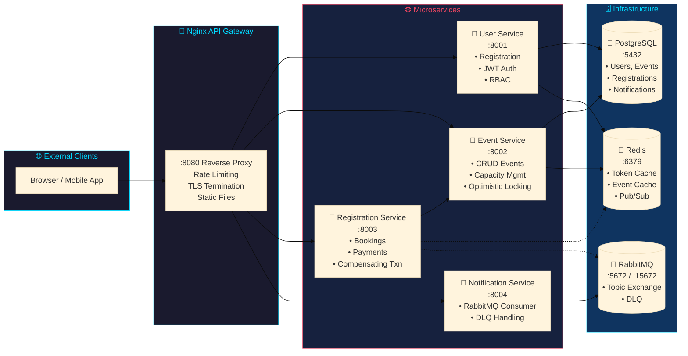
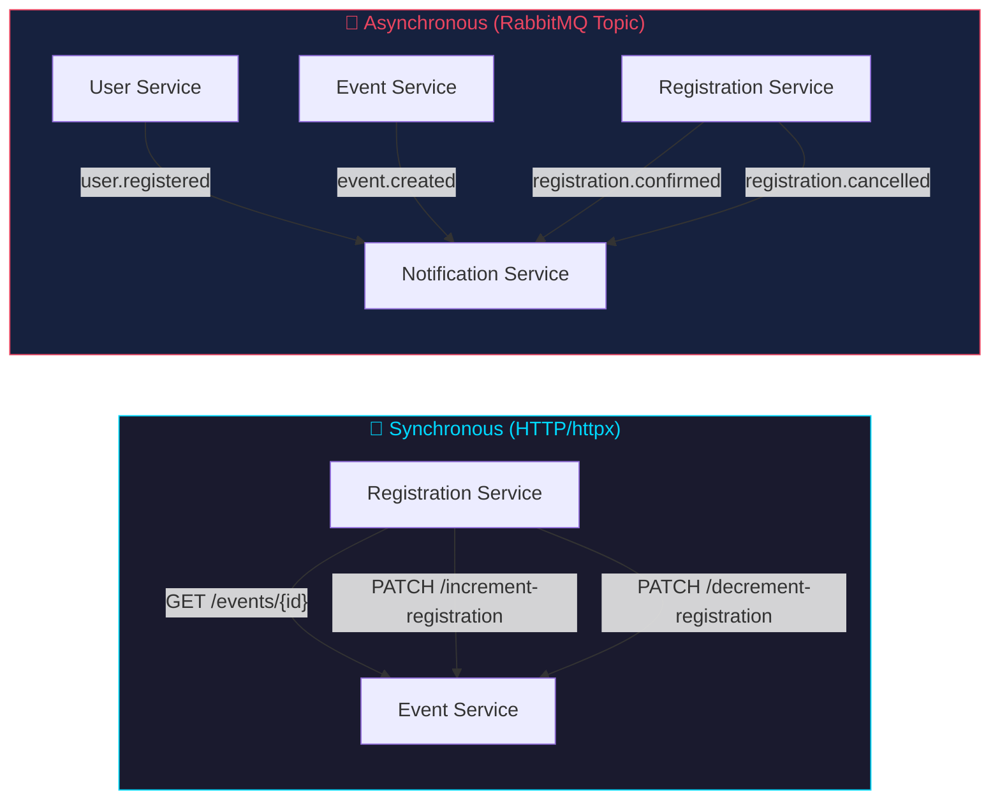
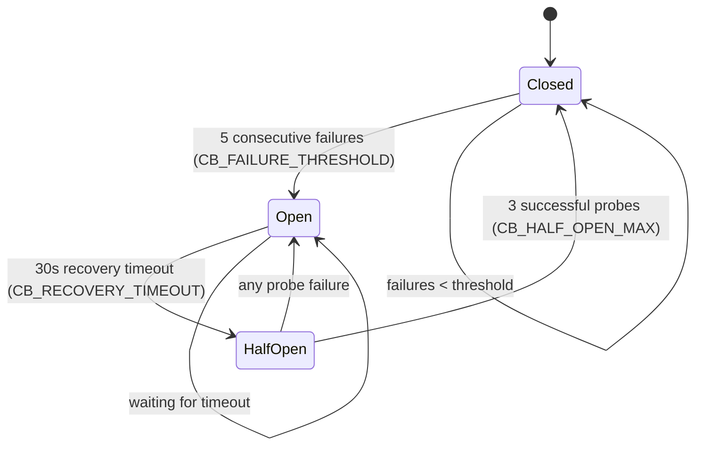
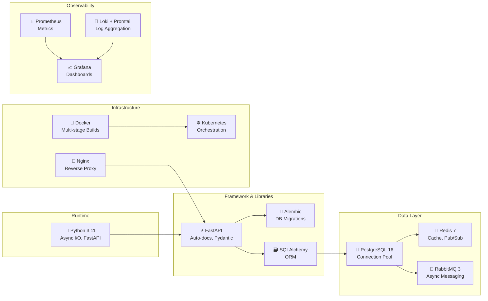
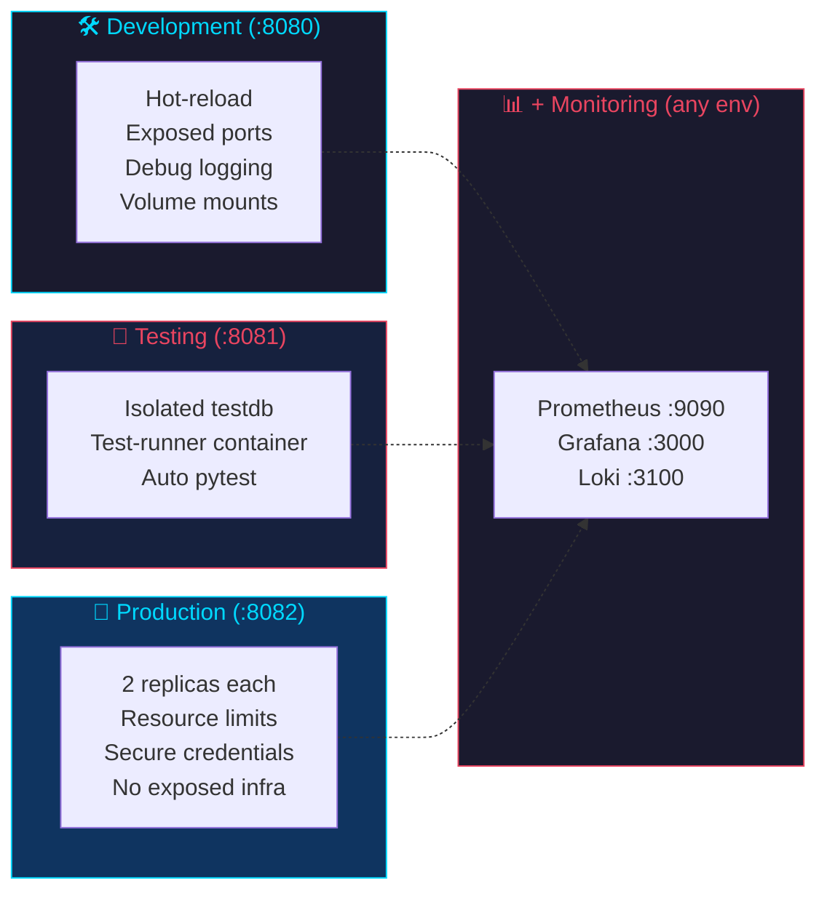

# Event Management System — Cloud & DevOps Platform

> A production-grade microservices platform for managing conferences, workshops, and seminars. Built with Docker, FastAPI, PostgreSQL, RabbitMQ, Redis, and Kubernetes.

---

## Table of Contents

- [System Overview](#system-overview)
- [Architecture](#architecture)
- [Microservices](#microservices)
- [Communication Patterns](#communication-patterns)
- [Technology Stack](#technology-stack)
- [Getting Started](#getting-started)
- [Project Structure](#project-structure)
- [Environments](#environments)
- [API Reference](#api-reference)
- [Monitoring & Observability](#monitoring--observability)
- [Deployment](#deployment)
- [Testing](#testing)

---

## System Overview



**Key Features:**
- 🔐 **JWT-based RBAC** — 3 roles (super_admin, organizer, attendee)
- 🔄 **Circuit Breaker** — Protects registration → event-service calls
- 📊 **Optimistic Concurrency** — Version-based conflict detection on events
- 💾 **Redis Caching** — 30s TTL on event listings with automatic invalidation
- 📬 **Async Messaging** — RabbitMQ topic exchange with DLQ support
- 🏗️ **Multi-environment** — dev (8080), test (8081), prod (8082) simultaneously

---

## Architecture

### High-Level System Topology

```mermaid
flowchart TB
    subgraph Internet["🌐 Internet"]
        CLIENT["Client Browser / API Consumer"]
    end

    subgraph Gateway["Nginx API Gateway (:80/:8080)"]
        NGINX["Reverse Proxy\nRate Limiting\nAuth Headers\nCorrelation ID"]
    end

    subgraph AppServices["Application Microservices"]
        USER["👤 User Service\nFastAPI :8001\nPostgreSQL / Redis\nJWT Auth + RBAC"]
        EVENT["📅 Event Service\nFastAPI :8002\nPostgreSQL / Redis\nCapacity + Versioning"]
        REG["🎫 Registration Service\nFastAPI :8003\nPostgreSQL\nhttpx → Event Service\nCircuit Breaker"]
        NOTIF["🔔 Notification Service\nFastAPI :8004\nPostgreSQL\nRabbitMQ Consumer\nDLQ Handler"]
    end

    subgraph DataLayer["Data & Messaging Layer"]
        PG["🐘 PostgreSQL\nShared DB, Own Tables\nConnection Pool\nAlembic Migrations"]
        RD["📡 Redis\nToken Cache\nEvent Cache\nPub/Sub Channel"]
        MQ["🐰 RabbitMQ\nTopic Exchange\nnotification_queue\nnotification_dlx"]
    end

    CLIENT --> NGINX --> USER & EVENT & REG & NOTIF

    USER --> PG
    EVENT --> PG
    REG --> PG
    NOTIF --> PG

    REG -.http.->|"/events/id/increment"| EVENT
    REG -.http.->|"/events/id/decrement"| EVENT

    USER -.publish.-> MQ
    EVENT -.publish.-> MQ
    REG -.publish.-> MQ

    NOTIF -.consume.-> MQ

    USER -.publish.-> RD
    EVENT -.publish.-> RD
    REG -.publish.-> RD

    style Gateway fill:#1a1a2e,stroke:#00d9ff,color:#00d9ff
    style AppServices fill:#16213e,stroke:#e94560,color:#e94560
    style DataLayer fill:#0f3460,stroke:#00d9ff,color:#00d9ff
```

### Communication Patterns



### Registration Flow with Compensating Transaction

```mermaid
sequenceDiagram
    participant C as Client
    participant REG as Registration Service
    participant EVT as Event Service
    participant MQ as RabbitMQ
    participant NOTIF as Notification Service

    C->>+REG: POST /api/registrations {event_id, payment_method}
    REG->>+EVT: GET /events/{id}
    EVT-->-REG: event data
    REG->>+EVT: PATCH /events/{id}/increment-registration
    alt Event full
        EVT-->-REG: 409 Conflict
        REG-->-C: 409 Event is full
    end
    EVT-->-REG: {registered_count, max_capacity}

    REG->>REG: process_payment_mock()
    alt Payment Success
        REG->>+PG: INSERT registration
        PG-->-REG: registration created
        REG->>REG: Generate ticket (TKT-XXXX-XXXX)
        REG->>MQ: Publish registration.confirmed
        REG-->-C: 200 OK {ticket_number}
    else Payment Failed
        REG->>+EVT: PATCH /events/{id}/decrement-registration
        EVT-->-REG: compensated
        REG-->-C: 402 Payment Failed
    end

    MQ->>+NOTIF: registration.confirmed
    NOTIF->>PG: INSERT notification (confirmed)
    NOTIF-->-MQ: ack
```

### Circuit Breaker State Machine



---

## Microservices

### User Service (`services/user-service/`)

| Endpoint | Method | Auth | Description |
|----------|--------|------|-------------|
| `/users/register` | POST | Public | Register new user with role (bcrypt hashing) |
| `/users/login` | POST | Public | Authenticate, return JWT token |
| `/users` | GET | Any user | List all active users |
| `/users/me` | GET | Any user | Get current user profile from JWT |
| `/users/{id}` | GET | Any user | Get user by ID |
| `/users/{id}/role` | PUT | super_admin | Update user role |
| `/users/{id}` | DELETE | Self or super_admin | Soft-delete (is_active=FALSE) |
| `/health` | GET | Public | Service health check |

**Publishes:** `user.registered` to RabbitMQ

### Event Service (`services/event-service/`)

| Endpoint | Method | Auth | Description |
|----------|--------|------|-------------|
| `/events` | POST | organizer, super_admin | Create event |
| `/events` | GET | Any user or service | List events (filter by type, status; paginated) |
| `/events/{id}` | GET | Any user or service | Get event by ID |
| `/events/{id}` | PUT | organizer (own), super_admin | Update event (requires `version`; returns 409 on conflict) |
| `/events/{id}` | DELETE | organizer (own), super_admin | Cancel event (requires `?version=N`) |
| `/events/{id}/increment-registration` | PATCH | Service key or super_admin | Atomically increment registered_count |
| `/events/{id}/decrement-registration` | PATCH | Service key or super_admin | Atomically decrement registered_count |
| `/health` | GET | Public | Service health check |

**Publishes:** `event.created` to RabbitMQ

### Registration Service (`services/registration-service/`)

| Endpoint | Method | Auth | Description |
|----------|--------|------|-------------|
| `/registrations` | POST | attendee, organizer, super_admin | Register for event |
| `/registrations` | GET | Any user (own only; super_admin sees all) | List registrations |
| `/registrations/{id}` | GET | Own user or super_admin | Get registration by ID |
| `/registrations/user/{user_id}` | GET | Own user or super_admin | List registrations by user |
| `/registrations/event/{event_id}` | GET | Any user | List confirmed registrations by event |
| `/registrations/{id}/payment` | PATCH | super_admin | Update payment status |
| `/registrations/{id}/process-payment` | POST | Own user or super_admin | Retry payment |
| `/registrations/{id}` | DELETE | Own user or super_admin | Cancel registration |
| `/health` | GET | Public | Health check + circuit breaker state |

**Publishes:** `registration.confirmed`, `registration.cancelled` to RabbitMQ

**Flow:** Fetch event → Increment capacity → Process payment → Insert registration → On failure: compensating decrement

### Notification Service (`services/notification-service/`)

| Endpoint | Method | Auth | Description |
|----------|--------|------|-------------|
| `/notifications` | POST | super_admin | Create notification |
| `/notifications/user/{user_id}` | GET | Own user or super_admin | List notifications by user |
| `/notifications/{id}/read` | PATCH | Own user or super_admin | Mark as read |
| `/notifications/broadcast` | POST | super_admin | Send to multiple users |
| `/notifications/dlq/stats` | GET | super_admin | Dead Letter Queue statistics |
| `/health` | GET | Public | Service health check |

**Consumes:** All routing keys from `events` exchange via `notification_queue`

---

## Communication Patterns

| Pattern | Technology | Example |
|---------|-----------|---------|
| **Sync request/response** | HTTP (httpx) | Registration → Event (capacity check) |
| **Async fire-and-forget** | RabbitMQ (topic) | User registered → Notification service |
| **Cache/Pub-Sub** | Redis | Events cache (30s TTL), session store |
| **API Gateway** | Nginx | Rate limiting, header forwarding |
| **Service-to-service auth** | X-Service-Key header | Internal HTTP calls |
| **Circuit breaker** | Custom | Registration → Event (opens after 5 failures) |
| **Dead Letter Queue** | RabbitMQ DLX | Failed notifications retry 3× then DLQ |
| **Correlation IDs** | X-Correlation-ID header | End-to-end request tracing |

---

## Technology Stack



| Category | Technology | Version | Purpose |
|----------|-----------|---------|---------|
| **Runtime** | Python | 3.11-slim | Application runtime |
| **Framework** | FastAPI | Latest | REST API framework |
| **Database** | PostgreSQL | 16-alpine | Primary data store |
| **Cache** | Redis | 7-alpine | Caching, pub-sub |
| **Message Broker** | RabbitMQ | 3-management-alpine | Async messaging |
| **API Gateway** | Nginx | Latest | Reverse proxy, rate limiting |
| **Metrics** | Prometheus | 2.48.0 | Metrics collection |
| **Visualization** | Grafana | 10.2.0 | Dashboards |
| **Logging** | Loki + Promtail | 2.9.3 | Centralized log aggregation |
| **Containerization** | Docker | — | Multi-stage builds |
| **Orchestration** | Kubernetes (Minikube) | — | Production deployment |
| **CI** | GitHub Actions | — | Automated testing |

---

## Getting Started

### Prerequisites

- Docker Desktop (or Docker Engine + Docker Compose)
- 4 GB RAM minimum (8 GB recommended)
- Git

### Quick Start (Development)

```bash
# Clone and start
git clone <repo-url>
cd event-management-cloud

# Start all services with hot-reload + monitoring
docker compose -f docker-compose.yml \
               -f docker-compose.dev.yml \
               -f docker-compose.monitoring.yml \
               up --build

# Wait ~30 seconds for all health checks to pass
```

### Access Points

| Service | URL | Credentials |
|---------|-----|------------|
| Frontend (nginx) | http://localhost:8080 | — |
| User Service | http://localhost:8001 | — |
| Event Service | http://localhost:8002 | — |
| Registration Service | http://localhost:8003 | — |
| Notification Service | http://localhost:8004 | — |
| Prometheus | http://localhost:9090 | — |
| Grafana | http://localhost:3000 | admin / admin |
| RabbitMQ Management | http://localhost:15672 | guest / guest |
| PostgreSQL | localhost:15432 | postgres / postgres |
| Redis | localhost:16379 | — |

### Quick API Test

```bash
# 1. Register an organizer
curl -X POST http://localhost:8080/api/users/register \
  -H "Content-Type: application/json" \
  -d '{"username":"alice","email":"alice@test.com","password":"Password123","full_name":"Alice","role":"organizer"}'

# 2. Login → get JWT token
TOKEN=$(curl -s -X POST http://localhost:8080/api/users/login \
  -H "Content-Type: application/json" \
  -d '{"email":"alice@test.com","password":"Password123"}' | jq -r '.token')

# 3. Create an event
curl -X POST http://localhost:8080/api/events \
  -H "Content-Type: application/json" \
  -H "Authorization: Bearer $TOKEN" \
  -d '{"title":"Tech Summit","description":"Annual conference","event_type":"conference","start_date":"2026-07-01 09:00:00","end_date":"2026-07-03 18:00:00","location":"Convention Center","max_capacity":200,"ticket_price":49.99}'

# 4. Register for event
curl -X POST http://localhost:8080/api/registrations \
  -H "Content-Type: application/json" \
  -H "Authorization: Bearer $TOKEN" \
  -d '{"event_id":1,"payment_method":"card"}'
```

---

## Project Structure

```mermaid
blockdiag
    blockdiag {
        orientation = portrait
        spanned = true

        EVENT["event-management-cloud/\nRoot Project"]

        DOCKER["docker-compose files\ndev · test · prod · monitoring"]
        DOCS["docs/\nArchitecture · Services\nInfrastructure · API · Deployment"]
        SERVICES["services/\nuser · event · registration · notification"]
        NGINX["nginx/\nAPI Gateway + Frontend"]
        K8S["k8s/\nManifests · ConfigMaps · Deployments"]
        HELM["helm/\nProduction Helm Chart"]
        MON["monitoring/\nPrometheus · Grafana · Loki"]
        TESTS["tests/\nIntegration Tests"]

        EVENT -> DOCKER & DOCS & SERVICES & NGINX & K8S & HELM & MON & TESTS

        SERVICES -> USER["user-service/\nFastAPI :8001"]
        SERVICES -> EVENT["event-service/\nFastAPI :8002"]
        SERVICES -> REG["registration-service/\nFastAPI :8003"]
        SERVICES -> NOTIF["notification-service/\nFastAPI :8004"]

        style EVENT fill:#1a1a2e,color:#00d9ff
        style DOCKER fill:#16213e,color:#e94560
        style DOCS fill:#16213e,color:#e94560
        style SERVICES fill:#0f3460,color:#00d9ff
        style NGINX fill:#0f3460,color:#00d9ff
        style K8S fill:#0f3460,color:#00d9ff
        style HELM fill:#0f3460,color:#00d9ff
        style MON fill:#0f3460,color:#00d9ff
        style TESTS fill:#0f3460,color:#00d9ff
    }
```

### Folder Descriptions

#### `services/`
Four independent FastAPI microservices. Each has its own Dockerfile, requirements.txt, and Alembic migrations with isolated version tables to avoid conflicts in the shared PostgreSQL database.

- **Shared patterns:** DB connection pooling, Redis singleton, RabbitMQ publisher, Prometheus instrumentation, CORS middleware, JWT auth, RBAC, structured JSON logging with correlation IDs

#### `nginx/`
API gateway + static frontend. Routes external requests, enforces rate limits (5 req/s auth, 30 req/s API), serves HTML pages.

#### `monitoring/`
Prometheus (8 scrape targets), Grafana (auto-provisioned datasources + 15-panel dashboard), Loki + Promtail (log aggregation), alert rules.

#### `k8s/`
11 Deployments, 1 DaemonSet, 12 Services, 1 ConfigMap, 1 Secret, 2 PVCs, RBAC for Prometheus.

#### `helm/`
Production-ready Helm chart with configurable values for replicas, resources, images, and infrastructure toggles.

---

## Environments



| Environment | Command | Port | DB | Special Features |
|-------------|---------|------|----|-----------------|
| **Development** | `-f docker-compose.yml -f docker-compose.dev.yml up` | 8080 | eventdb | Hot-reload, exposed service ports |
| **Testing** | `-f docker-compose.yml -f docker-compose.test.yml up` | 8081 | testdb | Isolated DB, test-runner container |
| **Production** | `-f docker-compose.yml -f docker-compose.prod.yml up` | 8082 | eventdb_prod | 2 replicas, resource limits |
| **+ Monitoring** | Append `-f docker-compose.monitoring.yml` to any | — | — | Prometheus, Grafana, Loki |

---

## API Reference

All endpoints are accessed through the nginx gateway at `http://localhost:8080/api/`.

### Nginx Route Mapping

| Gateway Route | Upstream Route | Service |
|--------------|---------------|---------|
| `/api/users/register` | `/users/register` | user-service |
| `/api/users/login` | `/users/login` | user-service |
| `/api/users` | `/users` | user-service |
| `/api/events` | `/events` | event-service |
| `/api/registrations` | `/registrations` | registration-service |
| `/api/notifications` | `/notifications` | notification-service |

### Payment Processing

| Method | Behavior |
|--------|----------|
| `free` | Always succeeds (ticket_price=0) |
| `card` / `credit_card` | 95% success, 5% random decline |
| `paypal` | 95% success, 5% random decline |
| `bank_transfer` | 95% success, 5% random decline |

On payment failure, the system automatically performs a compensating transaction (decrements event capacity) and returns HTTP 402.

---

## Monitoring & Observability

### Prometheus Targets (8 total)

| Target | Scrape URL | Description |
|--------|-----------|-------------|
| user-service | `http://user-service:8000/metrics` | HTTP metrics, Python runtime |
| event-service | `http://event-service:8000/metrics` | HTTP metrics, Python runtime |
| registration-service | `http://registration-service:8000/metrics` | HTTP metrics, Python runtime |
| notification-service | `http://notification-service:8000/metrics` | HTTP metrics, Python runtime |
| postgres-exporter | `http://postgres-exporter:9187/metrics` | Database metrics |
| redis-exporter | `http://redis-exporter:9121/metrics` | Cache metrics |
| node-exporter | `http://node-exporter:9100/metrics` | System metrics |
| prometheus | `http://localhost:9090/metrics` | Self-monitoring |

### Grafana Dashboard (15 panels)

Service Status · Infrastructure Status · Request Rate · Response Time · Error Rate · CPU/Memory · DB connections · Redis hit rate

### Alerting

| Alert | Condition | Severity |
|-------|-----------|----------|
| ServiceDown | `up == 0` for 1m | Critical |
| HighErrorRate | 5xx rate > 10% for 5m | Warning |
| HighResponseTime | p95 latency > 2s for 5m | Warning |
| PostgresConnectionsHigh | Active connections > 80 for 5m | Warning |
| RedisMemoryHigh | Memory usage > 90% for 5m | Warning |
| RabbitMQQueueDepthHigh | notification_queue > 1000 for 10m | Warning |

### Log Aggregation

All services emit structured JSON logs: `timestamp`, `level`, `service`, `message`, `correlation_id`. Query in Grafana Explore:

```
{service="user-service"}
{service="registration-service"} |= "error"
{service="notification-service"} | json | correlation_id="abc-123"
```

---

## Deployment

### Helm Chart (Recommended)

```bash
# Install
helm install event-management ./helm/event-management

# Upgrade
helm upgrade event-management ./helm/event-management

# Uninstall
helm uninstall event-management
```

Features: Parameterized replicas/resources/images · ConfigMap + Secret auto-generated · Infrastructure toggles · PVCs for stateful services

### ArgoCD (GitOps)

```bash
kubectl apply -f k8s/argocd/application.yaml
```

- Auto-sync with self-heal enabled
- Prunes deleted resources
- Retries failed syncs (5 attempts, exponential backoff)

### Raw Kubernetes Manifests

```bash
minikube start --driver=docker --cpus=2 --memory=2048
eval $(minikube docker-env)
docker compose -f docker-compose.yml build

kubectl apply -f k8s/configmaps/
kubectl apply -f k8s/services/
kubectl apply -f k8s/deployments/
kubectl apply -f k8s/monitoring/

minikube service nginx --url
```

### K8s Resources Summary

| Type | Count | Details |
|------|-------|---------|
| Deployments | 11 | 4 services + postgres + redis + rabbitmq + nginx + prometheus + grafana + loki |
| DaemonSets | 1 | promtail |
| Services | 12 | ClusterIP + NodePort |
| ConfigMaps | 1 | App configuration |
| Secrets | 1 | DB, Redis, RabbitMQ credentials |
| PVCs | 2 | postgres 1Gi, redis 512Mi |

---

## Testing

```bash
# Run integration tests
./manage.sh test

# Or manually
docker compose -f docker-compose.yml -f docker-compose.test.yml up --build test-runner
```

### Test Coverage (38 tests)

- **Health checks**: All services + gateway + circuit breaker state
- **User auth**: Register, login, duplicate prevention, wrong password, invalid tokens
- **RBAC**: Role-based access enforcement
- **Input validation**: Password, email, role, payment method
- **Event CRUD**: Create, list, get, 404 handling
- **Optimistic concurrency**: Correct version updates, stale version returns 409
- **Registration**: Register, duplicate returns 409, paginated listing
- **Correlation IDs**: Custom ID propagation, auto-generation
- **Notifications**: Create, get, DLQ stats, ownership scoping

---

## Database Schema

### Tables

| Table | Service | Key Columns |
|-------|---------|-------------|
| `users` | user-service | id, username, email, password_hash, role, is_active |
| `events` | event-service | id, title, organizer_id, max_capacity, registered_count, **version** |
| `registrations` | registration-service | id, user_id, event_id, status, ticket_number |
| `notifications` | notification-service | id, user_id, is_read |

### Indexes

| Table | Index | Purpose |
|-------|-------|---------|
| `users` | `idx_users_email` | Fast email lookup |
| `events` | `idx_events_status_type` | Filter by status + event_type |
| `events` | `idx_events_start_date` | Sort by date |
| `events` | `idx_events_organizer` | Ownership scoping |
| `registrations` | `idx_reg_user` | User's registrations |
| `registrations` | `idx_reg_event_status` | Event attendees |
| `notifications` | `idx_notifications_user_read` | User notification feed |

---

## Management Script

```bash
./manage.sh <command> [env] [--monitor]

Commands:
  up dev|test|prod       Start environment
  down dev|test|prod     Stop environment
  down-all               Stop all environments
  logs dev|test|prod     Tail logs
  build dev|test|prod    Rebuild images
  test                   Run integration tests
  k8s-up                 Deploy to Minikube
  k8s-down               Remove from Minikube
  status                 Show running containers
  clean                  Remove all volumes and containers

Examples:
  ./manage.sh up dev               # Start dev (http://localhost:8080)
  ./manage.sh up dev --monitor     # + Prometheus, Grafana, Loki
  ./manage.sh up prod              # Start prod (http://localhost:8082)
  ./manage.sh down-all            # Stop everything
```

---

## License

Built for educational purposes as part of a Cloud Computing & DevOps course.