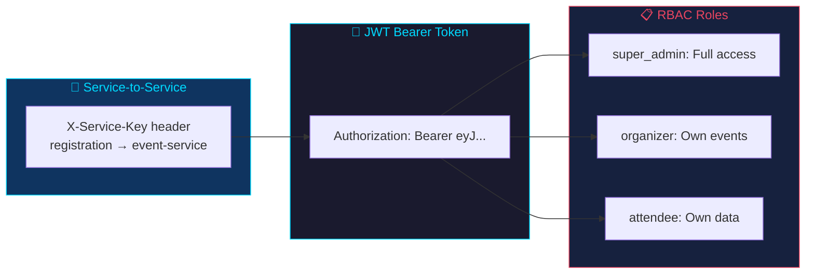

# API Reference — Complete Endpoint Documentation

> All endpoints are accessed through the nginx gateway at `http://localhost:8080/api/`.

---

## Table of Contents

- [Authentication](#authentication)
- [User Service](#user-service)
- [Event Service](#event-service)
- [Registration Service](#registration-service)
- [Notification Service](#notification-service)
- [Health & Metrics](#health--metrics)

---

## Authentication



All endpoints (except register, login, and health) require a JWT Bearer token in the `Authorization` header.

### Roles

| Role | Capabilities |
|------|-------------|
| `super_admin` | Full access: manage all users, events, registrations, notifications; assign roles |
| `organizer` | Create/update/cancel own events; register for events; view own data |
| `attendee` | Register for events; view own registrations and notifications |

### Service-to-Service Auth

Internal service calls (e.g., registration-service → event-service) use the `X-Service-Key` header instead of JWT.

---

## User Service

### `POST /api/users/register` — Register

**Request Body:**

| Field | Type | Required | Constraints |
|-------|------|----------|-------------|
| username | string | yes | Unique, 3-50 chars, alphanumeric + underscore |
| email | string | yes | Unique, valid email format |
| password | string | yes | 8-128 chars |
| full_name | string | yes | 1-100 chars |
| role | string | no | `super_admin`, `organizer`, `attendee` (default) |

**Response (201):**
```json
{
  "message": "User registered successfully",
  "user": {
    "id": 1,
    "username": "alice",
    "email": "alice@test.com",
    "full_name": "Alice Smith",
    "role": "organizer",
    "created_at": "2026-05-10 18:15:57.750469"
  }
}
```

**Errors:**
| Status | Detail |
|--------|--------|
| 400 | Username or email already exists |
| 422 | Validation error (invalid format) |

**Side Effects:**
- Publishes `user.registered` to RabbitMQ → notification-service creates welcome notification
- Publishes to Redis channel `user_events`

---

### `POST /api/users/login` — Login

**Response (200):**
```json
{
  "token": "eyJhbGciOiJIUzI1NiIs...",
  "user": {
    "id": 1,
    "username": "alice",
    "email": "alice@test.com",
    "full_name": "Alice Smith"
  }
}
```

**Errors:**
| Status | Detail |
|--------|--------|
| 401 | Invalid credentials |

**Notes:**
- JWT token (HS256, 24h expiry) with user_id, username, email, and role claims
- Session stored in Redis with 24h TTL (`session:<jwt>`)
- Password verified using bcrypt (12 rounds)

---

### `GET /api/users` — List Users

**Auth:** Any authenticated user

**Response (200):**
```json
{
  "users": [
    {"id": 1, "username": "alice", "email": "alice@test.com", "full_name": "Alice Smith", "role": "organizer", "created_at": "..."}
  ],
  "total": 1
}
```

---

### `GET /api/users/me` — Current User

**Auth:** Any authenticated user

**Response (200):**
```json
{
  "id": 1,
  "username": "alice",
  "email": "alice@test.com",
  "full_name": "Alice Smith",
  "role": "organizer",
  "created_at": "2026-05-10 18:15:57.750469"
}
```

---

### `GET /api/users/{user_id}` — Get User

**Auth:** Any authenticated user

**Errors:**
| Status | Detail |
|--------|--------|
| 404 | User not found or deactivated |

---

### `PUT /api/users/{user_id}/role` — Update Role

**Auth:** super_admin only

**Request Body:**
```json
{"role": "organizer"}
```

**Response (200):**
```json
{
  "message": "Role updated",
  "user": {"id": 2, "username": "bob", "email": "bob@test.com", "role": "organizer"}
}
```

**Errors:**
| Status | Detail |
|--------|--------|
| 403 | Not a super_admin |
| 404 | User not found |

---

### `DELETE /api/users/{user_id}` — Soft Delete

**Auth:** Self-deletion or super_admin

**Response (200):** `{"message": "User deactivated"}`

**Errors:**
| Status | Detail |
|--------|--------|
| 403 | Can only deactivate your own account (unless super_admin) |
| 404 | User not found |

---

## Event Service

### `POST /api/events` — Create Event

**Auth:** organizer or super_admin

**Request Body:**

| Field | Type | Required | Default |
|-------|------|----------|---------|
| title | string | yes | — |
| description | string | yes | — |
| event_type | string | yes | — |
| start_date | string (ISO) | yes | — |
| end_date | string (ISO) | yes | — |
| location | string | yes | — |
| max_capacity | int | yes | 100 |
| organizer_id | int | no | Auto from JWT |
| ticket_price | float | no | 0.0 |

**Response (200):**
```json
{
  "message": "Event created",
  "event": {
    "id": 1, "title": "Tech Summit", "status": "active",
    "registered_count": 0, "max_capacity": 200, "ticket_price": 49.99, ...
  }
}
```

**Errors:**
| Status | Detail |
|--------|--------|
| 400 | end_date must be after start_date |
| 403 | Insufficient permissions (attendee cannot create events) |

**Side Effects:**
- Publishes `event.created` to RabbitMQ
- Publishes to Redis channel `event_events`

---

### `GET /api/events` — List Events

**Auth:** Any authenticated user (service key also accepted)

**Query Parameters:**

| Param | Type | Default | Description |
|-------|------|---------|-------------|
| event_type | string | — | Filter by type |
| status | string | `active` | Filter by status (super_admin can use `all`) |
| page | int | `1` | Page number (1-indexed) |
| page_size | int | `20` | Items per page (max 100) |

**Response (200):**
```json
{
  "events": [...],
  "total": 42,
  "page": 1,
  "page_size": 20,
  "total_pages": 3
}
```

**Caching:** Results cached in Redis (30s TTL). Cache invalidated on writes.

---

### `GET /api/events/{event_id}` — Get Event

**Auth:** Any authenticated user

---

### `PUT /api/events/{event_id}` — Update Event

**Auth:** organizer (own events only) or super_admin

**Request Body:**

| Field | Type | Required | Description |
|-------|------|----------|-------------|
| title | string | no | New title |
| description | string | no | New description |
| location | string | no | New location |
| max_capacity | int | no | New capacity |
| ticket_price | float | no | New price |
| **version** | int | **yes** | Current version for optimistic concurrency |

**Errors:**
| Status | Detail |
|--------|--------|
| 403 | Not the event owner or super_admin |
| 409 | Version mismatch (event was modified). Returns `{current_version, provided_version}` |

---

### `DELETE /api/events/{event_id}` — Cancel Event

**Auth:** organizer (own events only) or super_admin

**Query Parameters:**

| Param | Type | Required | Description |
|-------|------|----------|-------------|
| **version** | int | **yes** | Current version for optimistic locking |

**Errors:**
| Status | Detail |
|--------|--------|
| 403 | Not the event owner or super_admin |
| 409 | Version mismatch |

---

## Registration Service

### `POST /api/registrations` — Register for Event

**Auth:** attendee, organizer, or super_admin. user_id derived from JWT token.

**Request Body:**

| Field | Type | Required | Default | Values |
|-------|------|----------|---------|--------|
| event_id | int | yes | — | — |
| payment_method | string | no | `"free"` | `free`, `card`, `credit_card`, `paypal`, `bank_transfer` |
| notes | string | no | `null` | — |

**Response (200):**
```json
{
  "message": "Registration successful",
  "registration": {
    "id": 5,
    "user_id": 1,
    "event_id": 2,
    "status": "confirmed",
    "payment_method": "card",
    "payment_status": "paid",
    "ticket_number": "TKT-0005-MG98S2",
    "payment_reference": "TXN-D3835F77A60F011E",
    "payment_gateway": "simulated-card",
    "payment_processed_at": "2026-05-10 19:01:53.269171"
  }
}
```

**Errors:**
| Status | Detail |
|--------|--------|
| 404 | Event not found |
| 409 | Event is full / User already registered |
| 402 | Payment failed |
| 503 | Event service unavailable (circuit breaker open) |

**Registration Flow:**
```mermaid
sequenceDiagram
    participant C as Client
    participant REG as Registration Service
    participant EVT as Event Service
    participant MQ as RabbitMQ

    C->>+REG: POST /registrations {event_id, payment_method}
    REG->>+EVT: GET /events/{id} (X-Service-Key)
    EVT-->-REG: event data
    REG->>+EVT: PATCH /events/{id}/increment-registration (X-Service-Key)
    alt Event full
        EVT-->-REG: 409
        REG-->-C: 409 Event is full
    end
    EVT-->-REG: {registered_count: 101, max_capacity: 200}

    REG->>REG: process_payment_mock()
    alt Payment success
        REG->>REG: INSERT registration
        REG->>MQ: Publish registration.confirmed
        REG-->-C: 200 OK {ticket_number}
    else Payment failed
        REG->>EVT: PATCH /events/{id}/decrement-registration (X-Service-Key)
        REG-->-C: 402 Payment Failed
    end
```

---

### `GET /api/registrations` — List Registrations

**Auth:** Any user (scoped to own; super_admin sees all)

**Query Parameters:**

| Param | Type | Default | Description |
|-------|------|---------|-------------|
| page | int | `1` | Page number (1-indexed) |
| page_size | int | `20` | Items per page (max 100) |

**Response (200):**
```json
{
  "registrations": [...],
  "total": 15,
  "page": 1,
  "page_size": 20,
  "total_pages": 1
}
```

---

### `GET /api/registrations/{id}` — Get Registration

**Auth:** Own user or super_admin

---

### `GET /api/registrations/user/{user_id}` — User's Registrations

**Auth:** Own user or super_admin

---

### `GET /api/registrations/event/{event_id}` — Event Attendees

**Auth:** Any authenticated user

---

### `PATCH /api/registrations/{id}/payment` — Update Payment

**Auth:** super_admin only

```bash
curl -X PATCH http://localhost:8080/api/registrations/5/payment \
  -H "Content-Type: application/json" \
  -d '{"payment_status": "paid"}'
```

---

### `POST /api/registrations/{id}/process-payment` — Retry Payment

**Auth:** Own user or super_admin

**Request Body:**

| Field | Type | Required | Description |
|-------|------|----------|-------------|
| payment_method | string | yes | `free`, `card`, `credit_card`, `paypal`, `bank_transfer` |
| amount | float | yes | Payment amount |
| force_decline | boolean | no | Force payment decline for testing (default: false) |

---

### `DELETE /api/registrations/{id}` — Cancel Registration

**Auth:** Own user or super_admin

**Response (200):** `{"message": "Registration cancelled"}`

**Side Effects:**
- `PATCH /events/{id}/decrement-registration` on event-service
- Publishes `registration.cancelled` to RabbitMQ

---

## Notification Service

### `GET /api/notifications/user/{user_id}` — User Notifications

**Auth:** Own user or super_admin

**Query Parameters:**

| Param | Type | Default | Description |
|-------|------|---------|-------------|
| unread_only | boolean | false | Only return unread notifications |

**Response (200):**
```json
{
  "notifications": [
    {
      "id": 1,
      "user_id": 1,
      "title": "Welcome!",
      "message": "Welcome Alice! Your account has been created.",
      "notification_type": "info",
      "is_read": false,
      "created_at": "2026-05-10 18:15:57.788032"
    }
  ],
  "total": 1
}
```

---

### `POST /api/notifications` — Create Notification

**Auth:** super_admin only

```bash
curl -X POST http://localhost:8080/api/notifications \
  -H "Content-Type: application/json" \
  -d '{"user_id": 1, "title": "Alert", "message": "Test notification", "notification_type": "info"}'
```

---

### `PATCH /api/notifications/{id}/read` — Mark as Read

**Auth:** Own user or super_admin

**Response (200):** `{"message": "Marked as read"}`

---

### `POST /api/notifications/broadcast` — Broadcast

**Auth:** super_admin only

**Response (200):** `{"message": "Broadcast sent to 3 users"}`

---

### `GET /api/notifications/dlq/stats` — DLQ Statistics

**Auth:** super_admin only

**Response (200):**
```json
{
  "dlq_queue": "notification_dlx",
  "message_count": 2,
  "consumer_count": 0,
  "messages": [...]
}
```

---

## Health & Metrics

### Health Endpoints

```mermaid
flowchart TB
    G["GET /health (gateway)"]
    U["GET /api/users/health"]
    E["GET /api/events/health"]
    R["GET /api/registrations/health"]
    N["GET /api/notifications/health"]

    G -->|"inline"| GR["{\"status\":\"gateway-healthy\"}"]
    U --> US["user-service"]
    E --> ES["event-service"]
    R --> RS["registration-service (circuit_breaker state)"]
    N --> NS["notification-service"]

    style G fill:#1a1a2e,stroke:#00d9ff,color:#00d9ff
    style U & E & R & N fill:#16213e,stroke:#e94560,color:#e94560
```

**Via nginx gateway:**
```bash
curl http://localhost:8080/health                      # gateway
curl http://localhost:8080/api/users/health             # user-service
curl http://localhost:8080/api/events/health            # event-service
curl http://localhost:8080/api/registrations/health     # registration-service
curl http://localhost:8080/api/notifications/health     # notification-service
```

**Direct service access (dev only):**
```bash
curl http://localhost:8001/health  # user-service
curl http://localhost:8002/health  # event-service
curl http://localhost:8003/health  # registration-service
curl http://localhost:8004/health  # notification-service
```

### Metrics Endpoints

```bash
curl http://localhost:8001/metrics  # user-service
curl http://localhost:8002/metrics  # event-service
curl http://localhost:8003/metrics  # registration-service
curl http://localhost:8004/metrics  # notification-service
```

Metrics include: `http_requests_total`, `http_request_duration_seconds`, `http_request_size_bytes`, `http_response_size_bytes`, Python runtime metrics.

---

## Payment Processing

| Method | Success Rate | Reference Format | Gateway |
|--------|-------------|-----------------|---------|
| `free` | 100% | `FREE-XXXXXXXX` | `simulated-free` |
| `card` / `credit_card` | 95% | `TXN-XXXXXXXXXXXXXXXX` | `simulated-card` |
| `paypal` | 95% | `TXN-XXXXXXXXXXXXXXXX` | `simulated-paypal` |
| `bank_transfer` | 95% | `TXN-XXXXXXXXXXXXXXXX` | `simulated-bank_transfer` |

Declined payments return reference format `DECLINED-XXXXXXXX`.
