# Architecture Overview

> Deep-dive into the Event Management System's microservices architecture, communication patterns, data flows, and cross-cutting concerns.

---

## Table of Contents

- [Architecture Style](#architecture-style)
- [System Topology](#system-topology)
- [Communication Patterns](#communication-patterns)
- [Data Flow Diagrams](#data-flow-diagrams)
- [Cross-cutting Concerns](#cross-cutting-concerns)
- [Container Architecture](#container-architecture)
- [Technology Stack](#technology-stack)

---

## Architecture Style

**Microservices Architecture** with **API Gateway** pattern.

Each service is a standalone FastAPI application running in its own Docker container. Services communicate via synchronous HTTP calls (for request/response) and asynchronous messaging via RabbitMQ (for event-driven flows).

### Key Principles

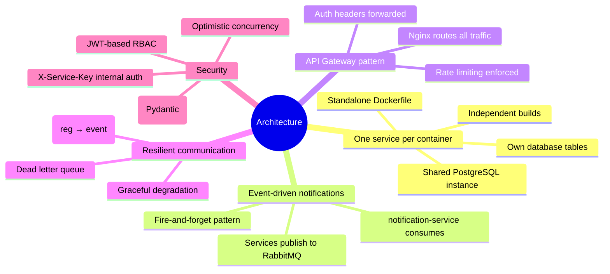

---

## System Topology

```mermaid
flowchart TB
    subgraph External["🌐 Internet / Local Client"]
        CLIENT["Browser / Mobile / API Consumer"]
    end

    subgraph Gateway["🚪 Nginx API Gateway"]
        direction TB
        NGINX["Reverse Proxy\nRate Limiting\nTLS Termination\nStatic Files\nHeader Forwarding\nCorrelation ID Gen"]
    end

    subgraph Services["⚙️ Application Services"]
        direction LR
        US["👤 User Service\n:8000 → :8001 (dev)\nPostgreSQL / Redis\nJWT Auth + RBAC\nPublishes: user.registered"]
        ES["📅 Event Service\n:8000 → :8002 (dev)\nPostgreSQL / Redis\nCapacity Mgmt + Versioning\nPublishes: event.created"]
        RS["🎫 Registration Service\n:8000 → :8003 (dev)\nPostgreSQL\nhttpx → Event Service\nCircuit Breaker\nPublishes: reg.confirmed/cancelled"]
        NS["🔔 Notification Service\n:8000 → :8004 (dev)\nPostgreSQL\nRabbitMQ Consumer\nDLQ Handler"]
    end

    subgraph Data["🗄️ Data & Messaging Layer"]
        PG[("🐘 PostgreSQL\n:5432\nusers | events\nregistrations | notifications")]
        RD[("📡 Redis\n:6379\nToken Cache (24h)\nEvent Cache (30s TTL)\nPub/Sub Channels")]
        MQ[("🐰 RabbitMQ\n:5672 / :15672\nTopic Exchange: events\nnotification_queue\nnotification_dlx")]
    end

    CLIENT --> NGINX
    NGINX --> US & ES & RS & NS

    US --> PG
    ES --> PG
    RS --> PG
    NS --> PG

    US --> RD
    ES --> RD
    RS --> RD

    RS -.http.-->|"X-Service-Key"| ES

    US -.publish.--> MQ
    ES -.publish.--> MQ
    RS -.publish.--> MQ
    NS -.consume.--> MQ

    style Gateway fill:#1a1a2e,stroke:#00d9ff,color:#00d9ff
    style Services fill:#16213e,stroke:#e94560,color:#e94560
    style Data fill:#0f3460,stroke:#00d9ff,color:#00d9ff
    style External fill:#1a1a2e,stroke:#00d9ff,color:#00d9ff
```

### RabbitMQ Queue Topology

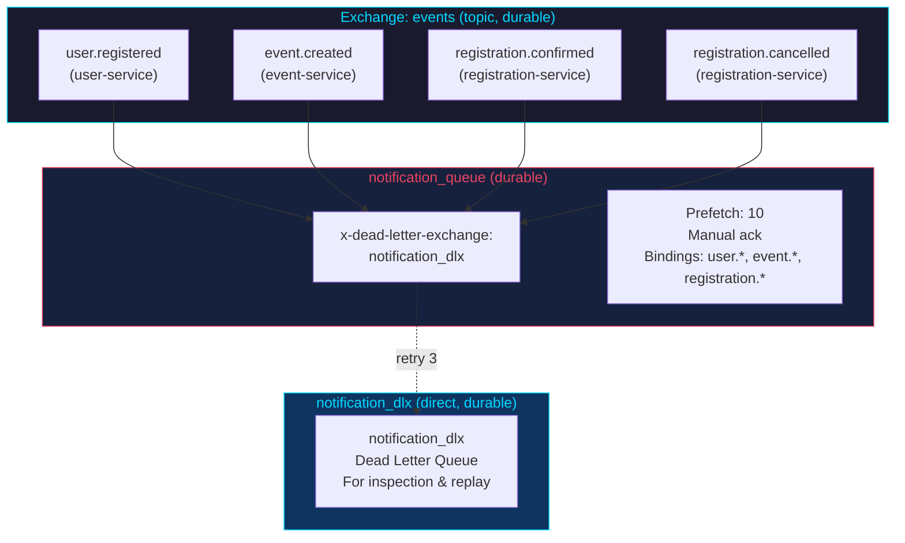

---

## Communication Patterns

### Synchronous (HTTP via httpx)

```mermaid
sequenceDiagram
    participant C as Client
    participant REG as Registration Service
    participant EVT as Event Service

    C->>+REG: POST /api/registrations {event_id, payment_method}
    REG->>+EVT: GET /events/{id} (X-Service-Key)
    EVT-->-REG: event data (capacity, status)
    REG->>+EVT: PATCH /events/{id}/increment-registration (X-Service-Key)
    alt Event full
        EVT-->-REG: 409 Conflict
        REG-->-C: 409 Event is full
    end
    EVT-->-REG: {registered_count: 101, max_capacity: 200}

    Note over REG: process_payment_mock()
    alt Payment success
        REG->>REG: INSERT registration
        REG-->-C: 200 OK {ticket_number}
    else Payment declined
        REG->>+EVT: PATCH /events/{id}/decrement-registration (X-Service-Key)
        EVT-->-REG: {registered_count: 100, max_capacity: 200}
        REG-->-C: 402 Payment Failed
    end
```

Used when the caller needs an immediate response to proceed. Inter-service HTTP calls include `X-Service-Key` header for authentication.

### Asynchronous (RabbitMQ Topic Exchange)

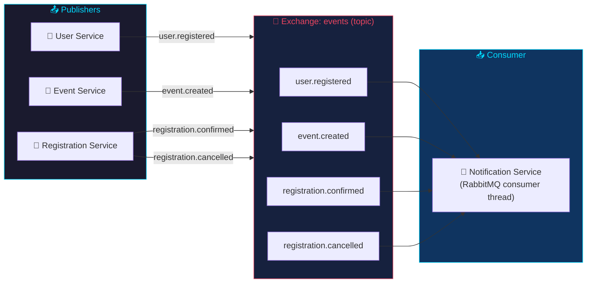

### Redis Usage Patterns

```mermaid
flowchart TB
    subgraph Token["Token Storage (user-service)"]
        T1["Login → JWT token"]
        T2["Redis: session:<jwt> → user_data"]
        T3["TTL: 24 hours"]
    end

    subgraph Cache["Response Caching (event-service)"]
        C1["GET /events"]
        C2["Build cache key:\nevents:list:{status}:{type}:{page}:{size}"]
        C3["Check Redis"]
        C4["hit → return cached\nmiss → query DB → cache (30s TTL)"]
        C5["Write: DELETE events:list:*"]
    end

    subgraph PubSub["Pub/Sub (backup channel)"]
        P1["user_events (user-service)"]
        P2["event_events (event-service)"]
        P3["notification_events (registration-service)"]
        Note: notification-service does NOT\nsubscribe (only RabbitMQ) to avoid duplicates
    end

    T1 --> T2 --> T3
    C1 --> C2 --> C3 --> C4
    C5 -.invalidate.-> C3

    style Token fill:#1a1a2e,stroke:#00d9ff,color:#00d9ff
    style Cache fill:#16213e,stroke:#e94560,color:#e94560
    style PubSub fill:#0f3460,stroke:#00d9ff,color:#00d9ff
```

### Circuit Breaker

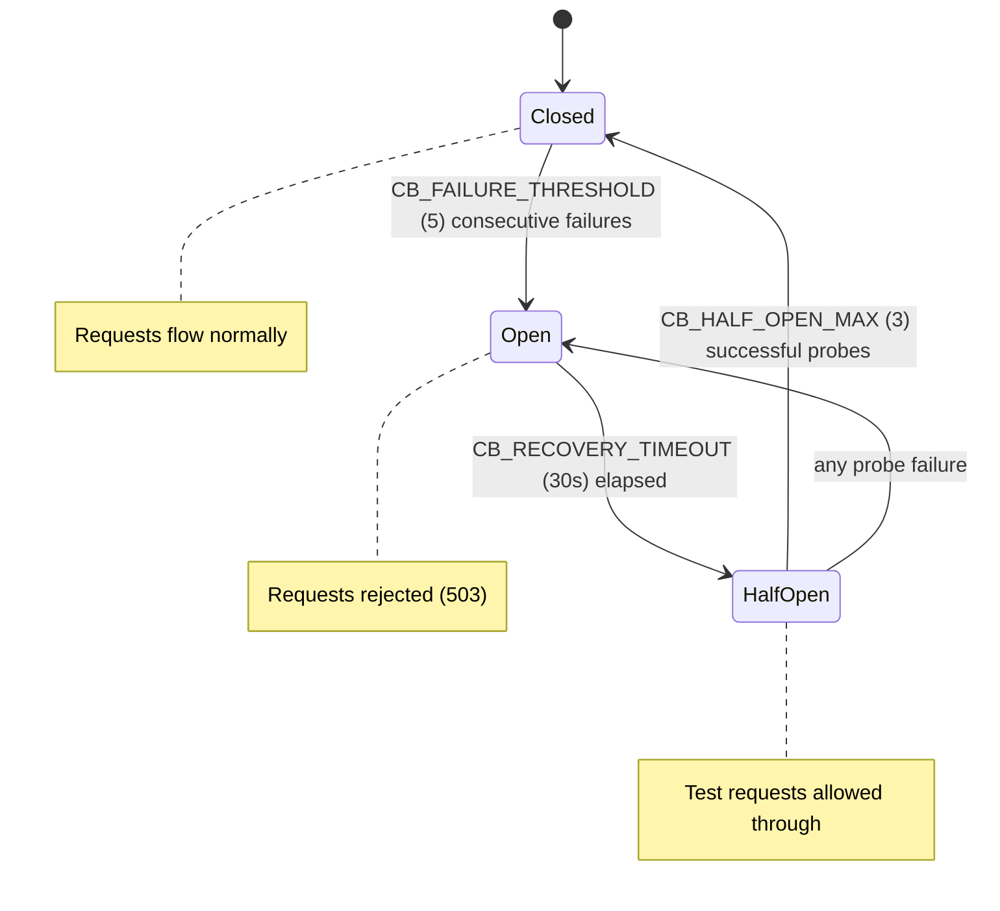

### Dead Letter Queue

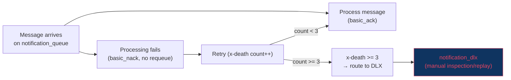

---

## Data Flow Diagrams

### User Registration Flow

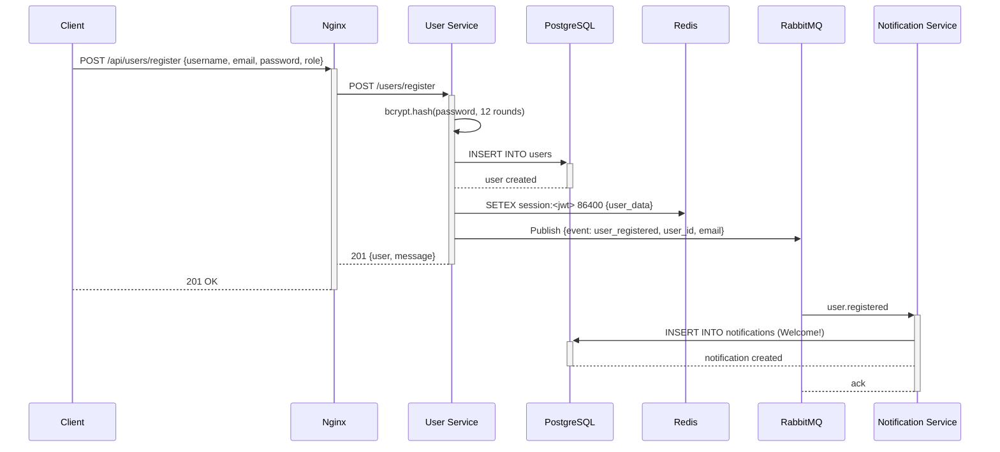

### Event Registration Flow (with Payment)

```mermaid
sequenceDiagram
    participant C as Client
    participant NG as Nginx
    participant RS as Registration Service
    participant ES as Event Service
    participant PG as PostgreSQL
    participant MQ as RabbitMQ
    participant NS as Notification Service

    C->>+NG: POST /api/registrations {event_id, payment_method}
    NG->>+RS: POST /registrations

    RS->>+ES: GET /events/{id} (X-Service-Key)
    ES-->-RS: event data

    RS->>+ES: PATCH /events/{id}/increment-registration (X-Service-Key)
    alt Event full
        ES-->-RS: 409
        RS-->-NG: 409 Event is full
        NG-->-C: 409 Conflict
    end
    ES-->-RS: {registered_count: 101, max_capacity: 200}

    RS->>RS: process_payment_mock()
    alt Payment Success
        RS->>+PG: INSERT INTO registrations
        PG-->-RS: registration created
        RS->>RS: Generate ticket TKT-XXXX-XXXX
        RS->>MQ: Publish {event: registration_confirmed, ticket_number}
        RS-->-NG: 200 {registration, ticket}
        NG-->-C: 200 OK
        MQ->>+NS: registration.confirmed
        NS->>+PG: INSERT INTO notifications (Confirmed!)
        PG-->-NS: notification created
        NS-->-MQ: ack
    else Payment Failed
        RS->>+ES: PATCH /events/{id}/decrement-registration (X-Service-Key)
        ES-->-RS: {registered_count: 100}
        RS-->-NG: 402 Payment Failed
        NG-->-C: 402
    end
```

### Notification Delivery Flow

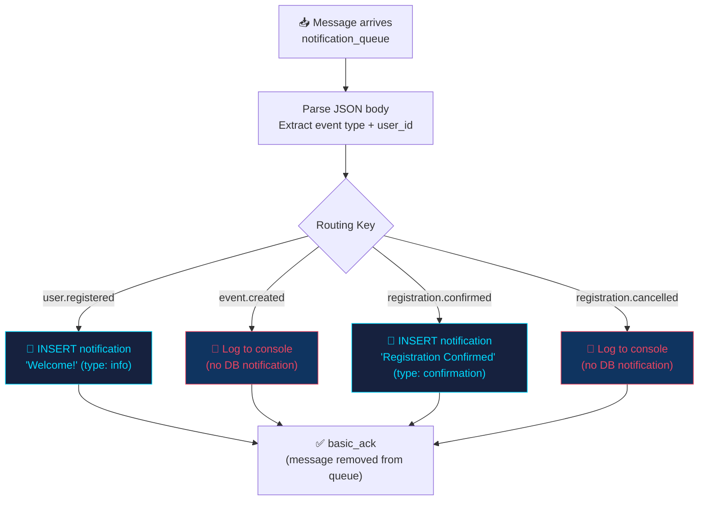

---

## Cross-cutting Concerns

### Health Checks

```mermaid
flowchart LR
    H1["GET /health\n(gateway)"]
    H2["GET /api/users/health"]
    H3["GET /api/events/health"]
    H4["GET /api/registrations/health"]
    H5["GET /api/notifications/health"]

    H1 -->|"inline 200"| NG["{\"status\":\"gateway-healthy\"}"]
    H2 -->|"proxy to :8001"| US["{\"status\":\"healthy\",\"service\":\"user-service\"}"]
    H3 -->|"proxy to :8002"| ES["{\"status\":\"healthy\",\"service\":\"event-service\"}"]
    H4 -->|"proxy to :8003"| RS["{\"status\":\"healthy\",\"service\":\"registration-service\",\"circuit_breaker\":{...}}"]
    H5 -->|"proxy to :8004"| NS["{\"status\":\"healthy\",\"service\":\"notification-service\"}"]

    style H1 fill:#1a1a2e,stroke:#00d9ff,color:#00d9ff
    style H2 fill:#16213e,stroke:#e94560,color:#e94560
    style H3 fill:#16213e,stroke:#e94560,color:#e94560
    style H4 fill:#16213e,stroke:#e94560,color:#e94560
    style H5 fill:#16213e,stroke:#e94560,color:#e94560
```

Infrastructure health checks:
- **PostgreSQL:** `pg_isready -U postgres` (10s interval)
- **Redis:** `redis-cli ping` (10s interval)
- **RabbitMQ:** `rabbitmq-diagnostics ping` (30s interval — avoids CPU spikes)

### Metrics (Prometheus)

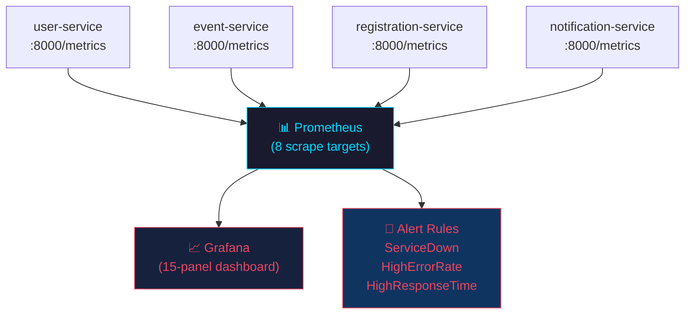

Metrics exposed:
- `http_requests_total` — counter by method, handler, status
- `http_request_duration_seconds` — histogram (p50, p95, p99)
- `http_request_size_bytes` / `http_response_size_bytes`
- Python runtime metrics (GC, memory, threads)

### Error Handling

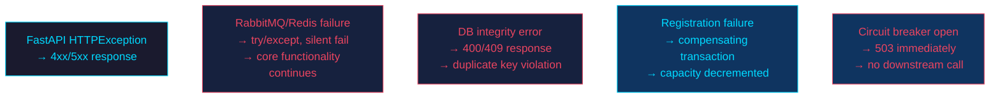

### Security Model

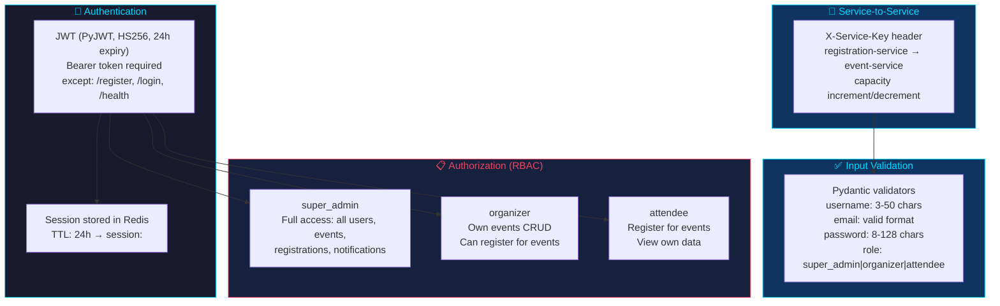

---

## Container Architecture

### Multi-stage Build Pattern (All Services)

```mermaid
flowchart TB
    subgraph Build["📦 Build Stage"]
        B1["FROM python:3.11-slim AS builder"]
        B2["COPY requirements.txt ."]
        B3["RUN pip install --no-cache-dir -r requirements.txt"]
    end

    subgraph Runtime["⚙️ Runtime Stage"]
        R1["FROM python:3.11-slim"]
        R2["COPY --from=builder /usr/local/lib/..."]
        R3["COPY . ."]
        R4["RUN useradd -m appuser"]
        R5["USER appuser"]
        R6["EXPOSE 8000"]
        R7["CMD [\"uvicorn\", \"main:app\", ...]"]
    end

    Build --> Runtime

    style Build fill:#1a1a2e,stroke:#00d9ff,color:#00d9ff
    style Runtime fill:#16213e,stroke:#e94560,color:#e94560
```

Benefits: Smaller image (~80-100MB) · No build tools in runtime · Non-root user · Cached dependency layer

### Docker Networking

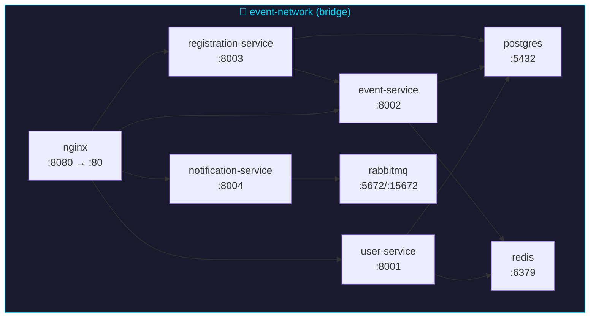

All containers share `event-network` bridge. Services reference each other by Docker Compose service name.

### Volume Strategy

| Volume | Purpose | Persistence |
|--------|---------|-------------|
| `postgres_data` | Database files | Survives restarts |
| `redis_data` | Redis append-only file | Survives restarts |
| `rabbitmq_data` | RabbitMQ state | Survives restarts |
| `prometheus_data` | Metrics storage | Survives restarts |
| `grafana_data` | Dashboard config | Survives restarts |
| `loki_data` | Log storage | Survives restarts |

Production uses separate volumes: `postgres_prod_data`, `redis_prod_data`, `rabbitmq_prod_data`.

---

## Technology Stack

```mermaid
graph LR
    subgraph Runtime["🐍 Python 3.11"]
        PY["Async I/O\nType hints\nFastAPI"]
    end

    subgraph API["⚡ FastAPI"]
        FA["REST endpoints\nAuto OpenAPI docs\nPydantic validation"]
    end

    subgraph DB["🗄️ PostgreSQL 16"]
        PG["Connection Pool\nThreadedConnectionPool\nAlembic migrations"]
    end

    subgraph Cache["📡 Redis 7"]
        RD["Token cache\nEvent cache (30s TTL)\nPub/Sub channels"]
    end

    subgraph MQ["🐰 RabbitMQ 3"]
        MQ["Topic exchange\nDLQ support\nPersistent messages"]
    end

    subgraph Gateway["🚪 Nginx"]
        NG["Reverse proxy\nRate limiting (5/30 r/s)\nHeader forwarding"]
    end

    subgraph Container["🐳 Docker"]
        DC["Multi-stage builds\nNon-root user\nLayer caching"]
    end

    subgraph K8s["☸️ Kubernetes"]
        K8["Minikube\nHelm charts\nArgoCD GitOps"]
    end

    subgraph Observe["📊 Observability"]
        PR["Prometheus (8 targets)\nGrafana (15 panels)\nLoki + Promtail"]
    end

    PY --> FA
    FA --> DB & Cache & MQ
    DB --> Cache & MQ
    NG --> FA
    DC --> K8
    PR --> Observe

    style Runtime fill:#1a1a2e,stroke:#00d9ff,color:#00d9ff
    style API fill:#16213e,stroke:#e94560,color:#e94560
    style DB fill:#0f3460,stroke:#00d9ff,color:#00d9ff
    style Cache fill:#0f3460,stroke:#00d9ff,color:#00d9ff
    style MQ fill:#0f3460,stroke:#e94560,color:#e94560
    style Gateway fill:#1a1a2e,stroke:#00d9ff,color:#00d9ff
    style Container fill:#16213e,stroke:#e94560,color:#e94560
    style K8s fill:#0f3460,stroke:#00d9ff,color:#00d9ff
    style Observe fill:#1a1a2e,stroke:#e94560,color:#e94560
```

| Layer | Technology | Purpose |
|-------|-----------|---------|
| **API Framework** | FastAPI | Async REST endpoints with auto-docs |
| **Database** | PostgreSQL 16 | Primary data store with connection pooling |
| **Cache** | Redis 7 | Pub-sub, token storage, caching |
| **Message Broker** | RabbitMQ 3 | Topic exchange for async events |
| **API Gateway** | Nginx | Reverse proxy, rate limiting, static files |
| **Metrics** | Prometheus | Time-series metrics collection |
| **Visualization** | Grafana | Dashboards, alerting |
| **Logging** | Loki + Promtail | Centralized log aggregation |
| **Containerization** | Docker | Multi-stage builds |
| **Orchestration** | Docker Compose / Kubernetes | Multi-environment deployment |
| **Authentication** | PyJWT | JWT token generation, validation, RBAC |
| **Migrations** | Alembic + SQLAlchemy | Per-service schema versioning with isolated version tables |
| **CI/CD** | GitHub Actions | Automated build + test |
| **Language** | Python 3.11 | Runtime for all services |