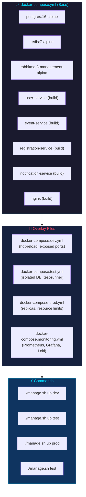
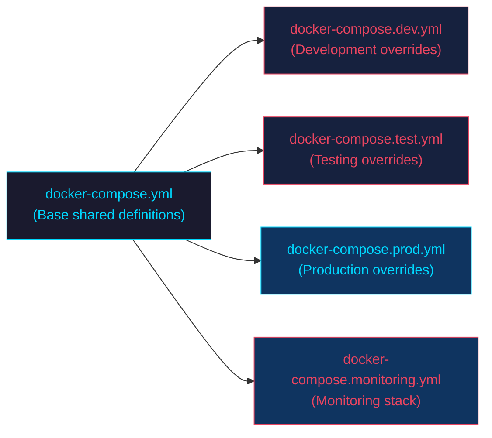
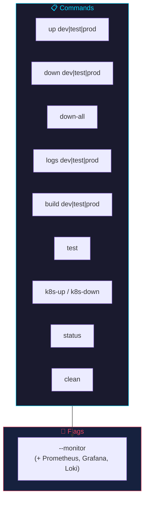
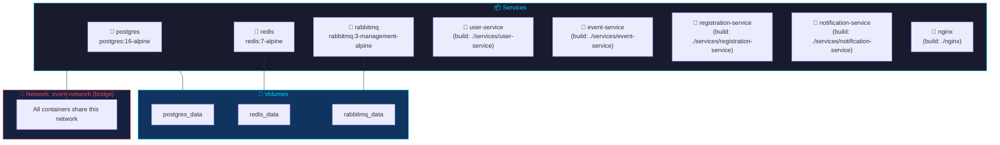
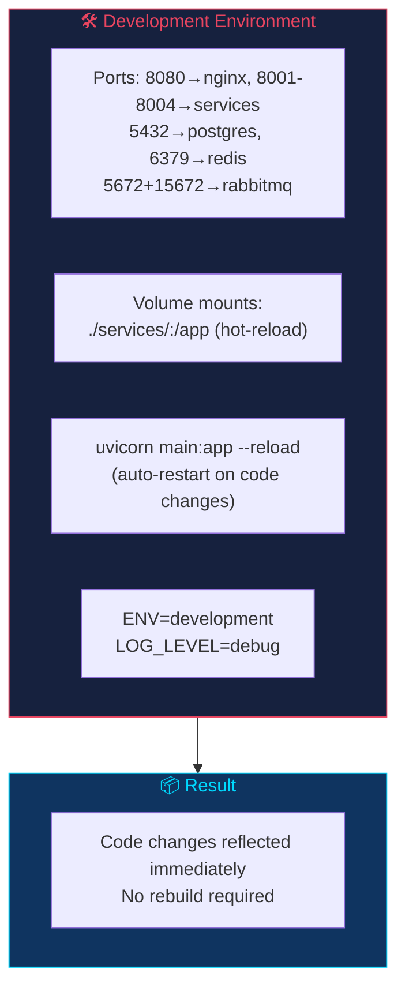
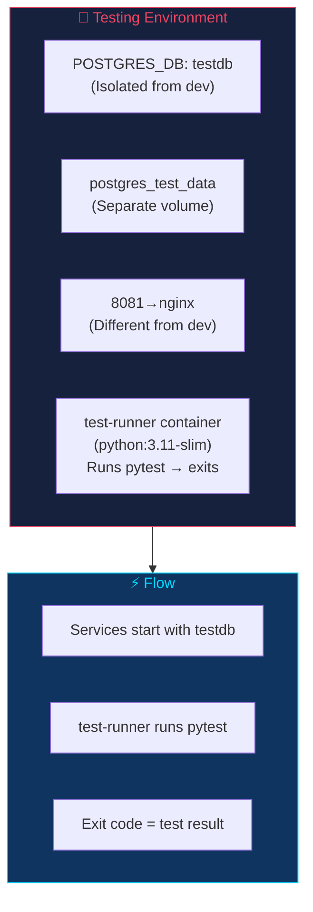
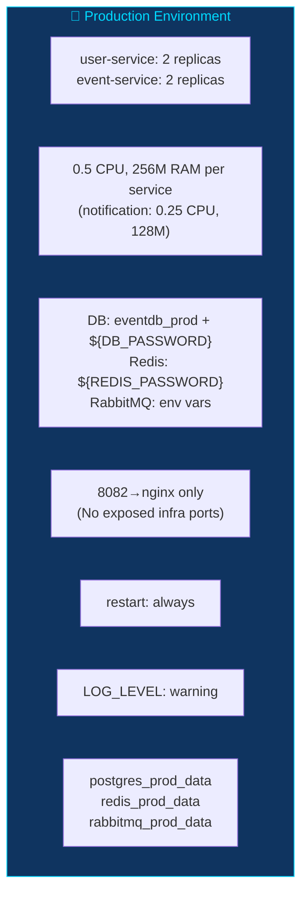
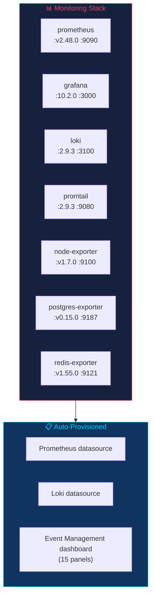
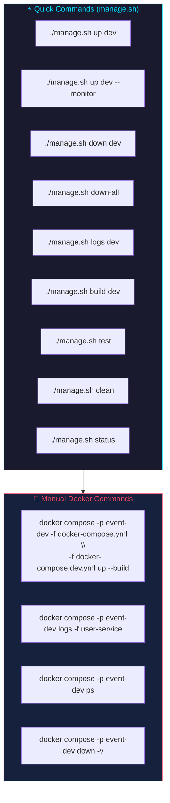

# Docker & Docker Compose Deployment

## Overview

The project uses Docker Compose with overlay files for different environments. Each service runs in its own container with multi-stage Docker builds. The `manage.sh` script provides a convenient CLI for managing all environments.



---

## Compose File Strategy



Overlay files are combined using multiple `-f` flags:

```bash
docker compose -f docker-compose.yml -f docker-compose.dev.yml up
```

Later files override earlier ones for the same service.

### Project Names

Each environment uses a unique Docker Compose project name (`event-dev`, `event-test`, `event-prod`) so multiple environments can run simultaneously without container name conflicts:

```bash
docker compose -p event-dev -f docker-compose.yml -f docker-compose.dev.yml up
```

---

## Management Script (`manage.sh`)



### Commands

| Command | Description |
|---------|-------------|
| `./manage.sh up dev` | Start dev (http://localhost:8080) |
| `./manage.sh up dev --monitor` | + Prometheus, Grafana, Loki, Promtail |
| `./manage.sh up test` | Start test (http://localhost:8081) |
| `./manage.sh up prod` | Start prod (http://localhost:8082) |
| `./manage.sh down dev` | Stop dev |
| `./manage.sh down-all` | Stop all environments |
| `./manage.sh logs dev` | Tail logs |
| `./manage.sh build dev` | Rebuild images |
| `./manage.sh test` | Run integration tests |
| `./manage.sh k8s-up` | Deploy to Minikube |
| `./manage.sh k8s-down` | Remove from Minikube |
| `./manage.sh status` | Show running containers |
| `./manage.sh clean` | Remove all volumes and containers |

---

## Base (`docker-compose.yml`)



**YAML Anchors:** `x-common-env` and `x-service-defaults` reduce repetition across services.

**Health checks:** postgres, redis, and rabbitmq have health checks; services use `depends_on` with `condition: service_healthy`.

**Network:** All services share `event-network` (bridge driver).

---

## Development (`docker-compose.dev.yml`)



```bash
docker compose -p event-dev -f docker-compose.yml -f docker-compose.dev.yml up --build
```

---

## Testing (`docker-compose.test.yml`)



```bash
docker compose -p event-test -f docker-compose.yml -f docker-compose.test.yml up --build
```

---

## Production (`docker-compose.prod.yml`)



```bash
docker compose -p event-prod -f docker-compose.yml -f docker-compose.prod.yml up --build -d
```

**Credentials:** Use `.env` file or export environment variables:
```bash
export DB_PASSWORD=your_secure_password
export REDIS_PASSWORD=your_redis_password
export RABBITMQ_PASSWORD=your_rabbitmq_password
```

---

## Monitoring (`docker-compose.monitoring.yml`)



```bash
docker compose -p event-dev -f docker-compose.yml -f docker-compose.dev.yml -f docker-compose.monitoring.yml up
```

---

## Dockerfiles

```mermaid
flowchart TB
    subgraph Build["📦 Build Stage"]
        B1["FROM python:3.11-slim AS builder"]
        B2["COPY requirements.txt ."]
        B3["RUN pip install --no-cache-dir -r requirements.txt"]
    end

    subgraph Runtime["⚙️ Runtime Stage"]
        R1["FROM python:3.11-slim"]
        R2["COPY --from=builder /usr/local/lib/python3.11/site-packages"]
        R3["COPY . ."]
        R4["RUN useradd -m appuser"]
        R5["USER appuser (non-root)"]
        R6["EXPOSE 8000"]
        R7["CMD [\"uvicorn\", \"main:app\", ...]"]
    end

    Build --> Runtime

    style Build fill:#1a1a2e,stroke:#00d9ff,color:#00d9ff
    style Runtime fill:#16213e,stroke:#e94560,color:#e94560
```

All service Dockerfiles follow the same multi-stage pattern:

```dockerfile
FROM python:3.11-slim AS builder
WORKDIR /app
COPY requirements.txt .
RUN pip install --no-cache-dir -r requirements.txt

FROM python:3.11-slim
WORKDIR /app
COPY --from=builder /usr/local/lib/python3.11/site-packages /usr/local/lib/python3.11/site-packages
COPY . .
RUN useradd -m appuser
USER appuser
EXPOSE 8000
CMD ["uvicorn", "main:app", "--host", "0.0.0.0", "--port", "8000"]
```

**Benefits:**
- Smaller runtime image (~80-100MB vs ~900MB for python:3.11)
- Non-root user for security
- Dependency layer cached for faster rebuilds

---

## Common Commands



```bash
# Using manage.sh (recommended)
./manage.sh up dev
./manage.sh up dev --monitor
./manage.sh down dev
./manage.sh down-all
./manage.sh logs dev
./manage.sh build dev
./manage.sh test
./manage.sh clean
./manage.sh status

# Manual docker compose commands
docker compose -p event-dev -f docker-compose.yml -f docker-compose.dev.yml up --build
docker compose -p event-dev -f docker-compose.yml -f docker-compose.dev.yml up -d
docker compose -p event-dev logs -f user-service
docker compose -p event-dev -f docker-compose.yml -f docker-compose.dev.yml down -v
docker compose -p event-dev ps
```