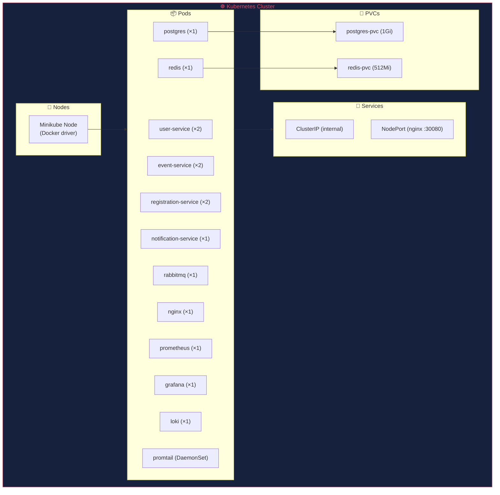
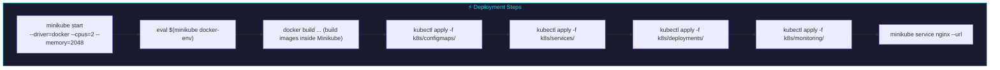
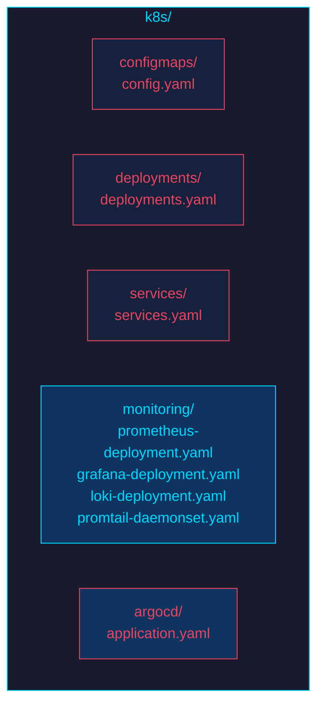
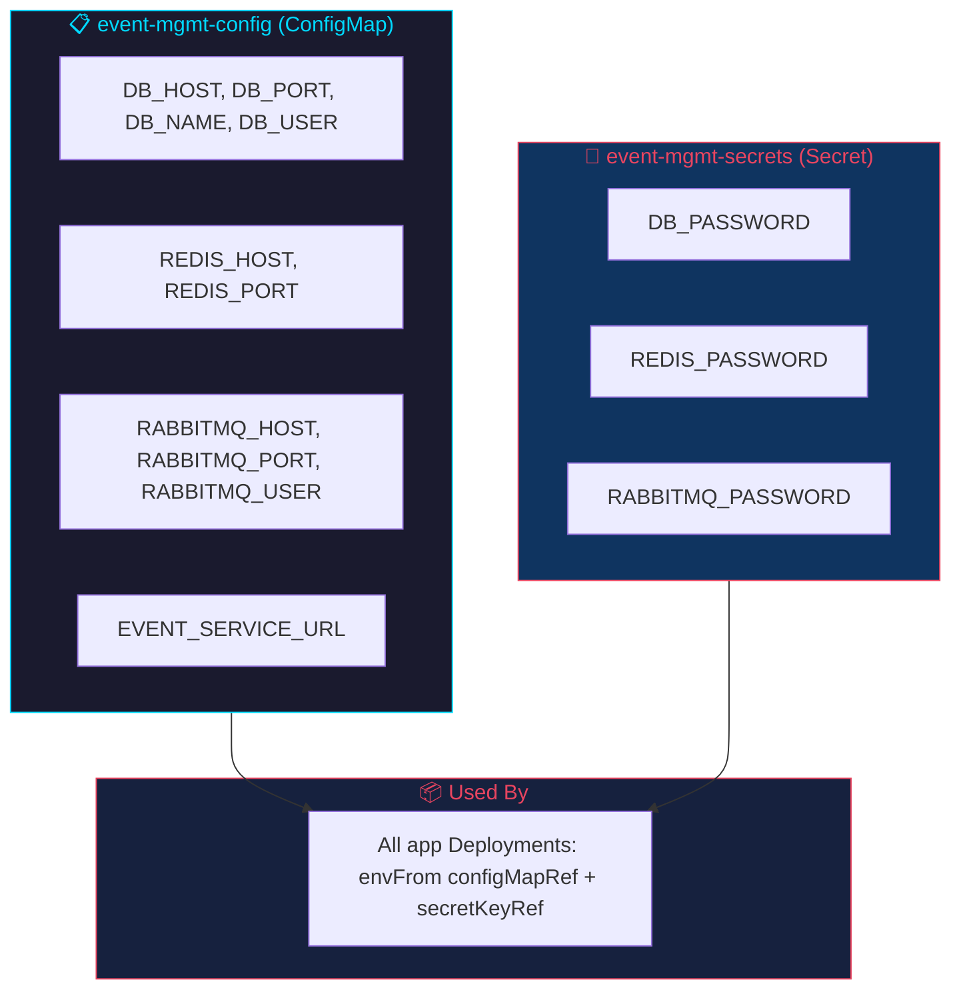
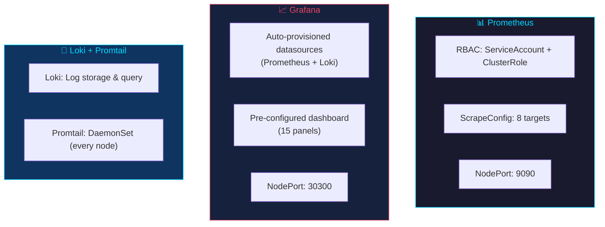
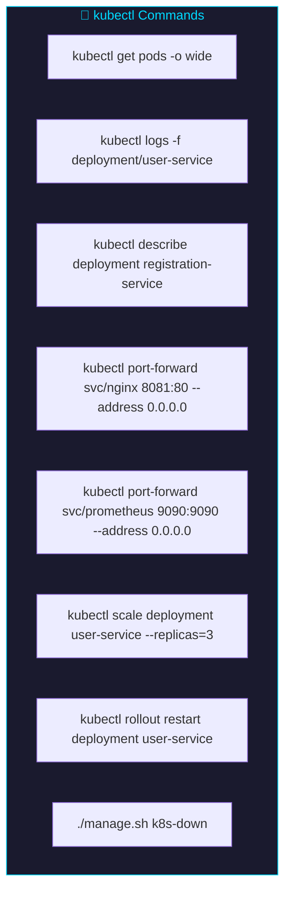

# Kubernetes Deployment

## Overview

The project includes Kubernetes manifests for deploying the full stack to a Minikube cluster. All images use `imagePullPolicy: Never` — they must be built inside Minikube's Docker daemon.



---

## Quick Start



### Using manage.sh

```bash
./manage.sh k8s-up
```

### Manual

```bash
# Start Minikube
minikube start --memory=8192 --cpus=4

# Use Minikube's Docker daemon
eval $(minikube docker-env)

# Build all images inside Minikube
docker build -t event-mgmt/user-service:latest ./services/user-service
docker build -t event-mgmt/event-service:latest ./services/event-service
docker build -t event-mgmt/registration-service:latest ./services/registration-service
docker build -t event-mgmt/notification-service:latest ./services/notification-service
docker build -t event-mgmt/nginx:latest ./nginx

# Apply manifests in order
kubectl apply -f k8s/configmaps/
kubectl apply -f k8s/services/
kubectl apply -f k8s/deployments/
kubectl apply -f k8s/monitoring/

# Wait for pods
kubectl get pods -w

# Access the app
minikube service nginx --url
```

---

## Directory Structure



```
k8s/
├── configmaps/
│   └── config.yaml            # ConfigMap + Secret
├── deployments/
│   └── deployments.yaml       # 8 Deployments + 1 DaemonSet + 2 PVCs
├── services/
│   └── services.yaml          # 8 Services (ClusterIP + NodePort)
└── monitoring/
    ├── prometheus-deployment.yaml
    ├── grafana-deployment.yaml
    ├── loki-deployment.yaml
    └── promtail-daemonset.yaml
```

---

## Resources Summary

| Resource | Count | Details |
|----------|-------|---------|
| **Deployments** | 8 | user-service(2), event-service(2), registration-service(2), notification-service(1), postgres(1), redis(1), rabbitmq(1), nginx(1) |
| **DaemonSets** | 1 | promtail (log collection on every node) |
| **Services** | 8 | ClusterIP (internal) + NodePort (nginx) |
| **ConfigMaps** | 1 | Application configuration (DB host, ports, service URLs) |
| **Secrets** | 1 | `event-mgmt-secrets` — DB password, Redis password, RabbitMQ credentials |
| **PVCs** | 2 | postgres (1Gi), redis (512Mi) |
| **ServiceAccounts** | 1 | prometheus |
| **ClusterRoles** | 1 | prometheus (kube-api read access) |
| **ClusterRoleBindings** | 1 | prometheus ↔ ServiceAccount |

---

## Configuration



### ConfigMap (`k8s/configmaps/config.yaml`)

Name: `event-mgmt-config`

Contains non-sensitive configuration.

### Secret (`k8s/configmaps/config.yaml`)

Name: `event-mgmt-secrets`

Contains sensitive credentials.

---

## Services

| Service | Type | Port | Target |
|---------|------|------|--------|
| postgres | ClusterIP | 5432 | postgres:5432 |
| redis | ClusterIP | 6379 | redis:6379 |
| rabbitmq | ClusterIP | 5672, 15672 | rabbitmq:5672, rabbitmq:15672 |
| user-service | ClusterIP | 8000 | user-service:8000 |
| event-service | ClusterIP | 8000 | event-service:8000 |
| registration-service | ClusterIP | 8000 | registration-service:8000 |
| notification-service | ClusterIP | 8000 | notification-service:8000 |
| nginx | NodePort | 80 → 30080 | nginx:80 |

All services use Kubernetes DNS names for internal communication (e.g., `postgres:5432`, `event-service:8000`).

---

## Deployments

### Replicas & Resources

| Deployment | Replicas | CPU Request/Limit | Memory Request/Limit |
|------------|----------|-------------------|---------------------|
| user-service | 2 | 100m / 500m | 128Mi / 256Mi |
| event-service | 2 | 100m / 500m | 128Mi / 256Mi |
| registration-service | 2 | 100m / 500m | 128Mi / 256Mi |
| notification-service | 1 | 50m / 250m | 64Mi / 128Mi |
| postgres | 1 | 100m / 500m | 128Mi / 512Mi |
| redis | 1 | 50m / 250m | 64Mi / 256Mi |
| rabbitmq | 1 | 100m / 500m | 256Mi / 512Mi |
| nginx | 1 | 50m / 200m | 32Mi / 64Mi |

### Readiness Probes

| Service | Type | Path/Command | Initial Delay | Period |
|---------|------|-------------|---------------|--------|
| user-service | HTTP GET | `/health` on :8000 | 15s | 10s |
| event-service | HTTP GET | `/health` on :8000 | 15s | 10s |
| registration-service | HTTP GET | `/health` on :8000 | 15s | 10s |
| notification-service | HTTP GET | `/health` on :8000 | 15s | 10s |
| nginx | HTTP GET | `/health` on :80 | 5s | 10s |
| postgres | Exec | `pg_isready -U postgres` | 10s | 5s |
| redis | Exec | `redis-cli ping` | 5s | 5s |
| rabbitmq | Exec | `rabbitmq-diagnostics ping` | 20s | 30s |

---

## Persistent Volumes

| PVC | Storage | Used By |
|-----|---------|---------|
| postgres-pvc | 1Gi | postgres Deployment |
| redis-pvc | 512Mi | redis Deployment |

Both use `ReadWriteOnce` access mode (single node).

---

## Monitoring Stack



---

## Startup Behavior

Services may CrashLoop on first start because they begin before Postgres/Redis are fully ready. This is expected — the services self-heal after 3-5 restarts as dependencies become available. No manual intervention required.

---

## Useful Commands



```bash
# Check pod status
kubectl get pods -o wide

# View pod logs
kubectl logs -f deployment/user-service

# Describe a deployment
kubectl describe deployment registration-service

# Port-forward for local access (Windows/Docker Desktop)
kubectl port-forward svc/nginx 8081:80 --address 0.0.0.0
# Then open http://localhost:8081

# Port-forward monitoring
kubectl port-forward svc/prometheus 9090:9090 --address 0.0.0.0
kubectl port-forward svc/grafana 3000:3000 --address 0.0.0.0

# Scale a service
kubectl scale deployment user-service --replicas=3

# Restart a deployment
kubectl rollout restart deployment user-service

# Delete everything
./manage.sh k8s-down
```