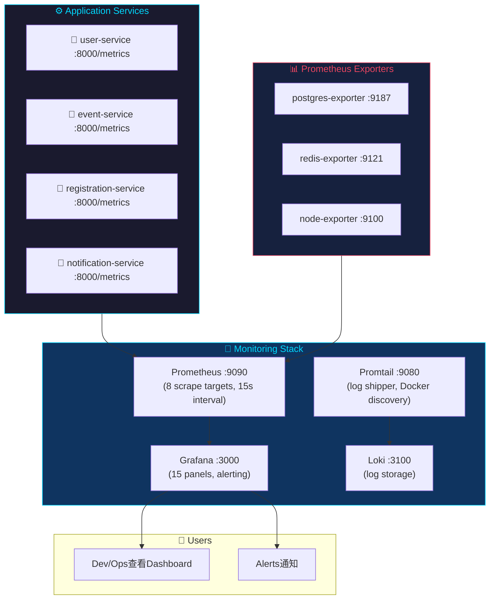
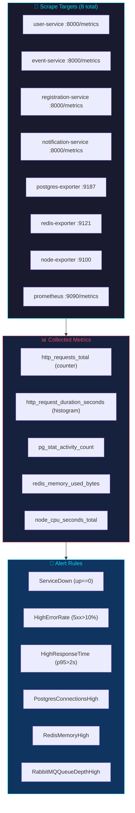
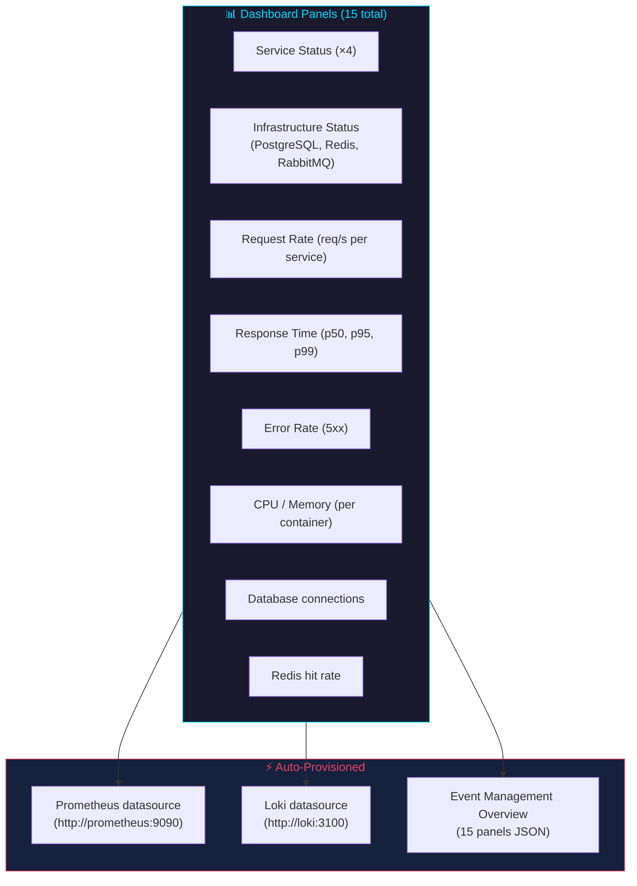
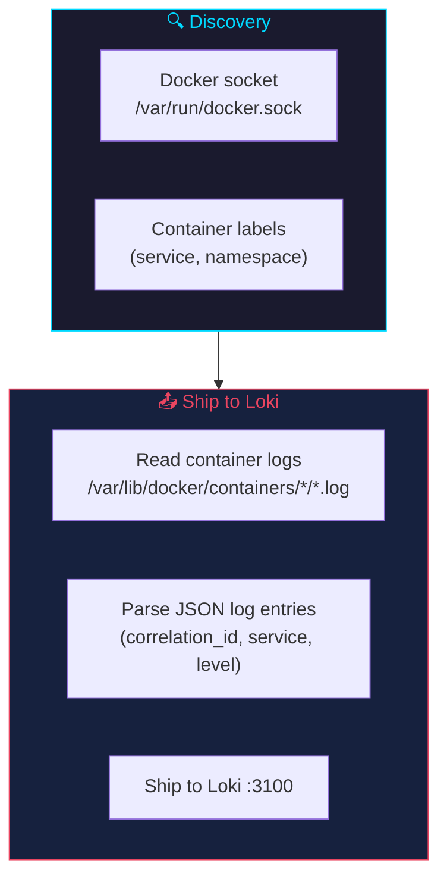
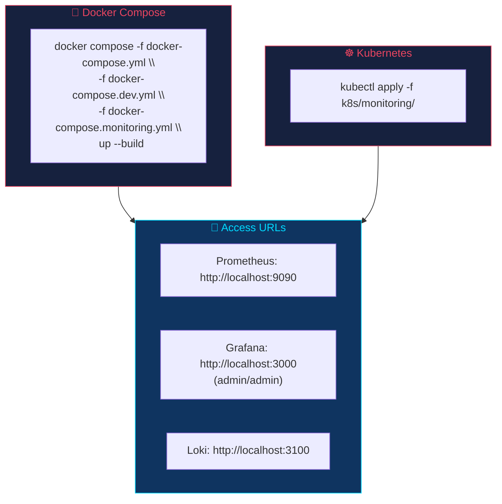

# Monitoring Stack

## Overview

The monitoring stack provides full observability: metrics collection (Prometheus), visualization (Grafana), log aggregation (Loki + Promtail), and infrastructure exporters.



---

## Components

### Prometheus (`prom/prometheus:v2.48.0`)



Collects metrics from all services and exporters every 15 seconds.

| Job | Target | Metrics |
|-----|--------|---------|
| user-service | `http://user-service:8000/metrics` | HTTP, Python runtime |
| event-service | `http://event-service:8000/metrics` | HTTP, Python runtime |
| registration-service | `http://registration-service:8000/metrics` | HTTP, Python runtime |
| notification-service | `http://notification-service:8000/metrics` | HTTP, Python runtime |
| postgres | `http://postgres-exporter:9187/metrics` | DB connections, queries, rows |
| redis | `http://redis-exporter:9121/metrics` | Memory, keys, hit rate |
| node | `http://node-exporter:9100/metrics` | CPU, memory, disk, network |
| prometheus | `http://localhost:9090/metrics` | Self-monitoring |

**Configuration file:** `monitoring/prometheus.yml`

---

### Grafana (`grafana/grafana:10.2.0`)



**Default credentials:** admin / admin

**Auto-provisioned resources:**
- **Datasources:** Prometheus + Loki (from `monitoring/grafana-datasources.yml`)
- **Dashboard:** Event Management Overview (15 panels from `monitoring/grafana-dashboards/`)

---

### Loki (`grafana/loki:2.9.3`)

```mermaid
flowchart TB
    subgraph Sources["📥 Log Sources"]
        S1["user-service (JSON logs)"]
        S2["event-service (JSON logs)"]
        S3["registration-service (JSON logs)"]
        S4["notification-service (JSON logs)"]
        S5["nginx (access logs)"]
    end

    subgraph Query["🔍 Query Interface"]
        Q1["Grafana Explore"]
        Q2["LogQL: {service=\"user-service\"}"]
        Q3["LogQL: {service=\"reg*\"} |= \"error\""]
    end

    Sources --> PROMT["Promtail\n(Docker socket discovery)"] --> Loki --> Query

    style Sources fill:#1a1a2e,stroke:#00d9ff,color:#00d9ff
    style Query fill:#16213e,stroke:#e94560,color:#e94560
```

Log aggregation engine. Stores logs and provides query interface.

**Configuration:** `monitoring/loki-config.yml`

**Query in Grafana Explore:**
```logql
{service="user-service"}
{service="registration-service"} |= "error"
{service="notification-service"} | json
```

---

### Promtail (`grafana/promtail:2.9.3`)



Log shipper. Discovers Docker containers, reads their logs, and ships to Loki.

**Configuration:** `monitoring/promtail-config.yml`

**Windows note:** On Windows with Docker Desktop, the `/var/lib/docker/containers` path may not be accessible. Promtail will run but may not collect container logs. Loki itself is fully functional for manual log pushes.

---

### Exporters

| Exporter | Image | Port | Scrape Target |
|----------|-------|------|---------------|
| postgres-exporter | `prometheuscommunity/postgres-exporter:v0.15.0` | 9187 | PostgreSQL metrics |
| redis-exporter | `oliver006/redis_exporter:v1.55.0` | 9121 | Redis metrics |
| node-exporter | `prom/node-exporter:v1.7.0` | 9100 | Host system metrics |

---

## Setup



---

## Useful Queries

### Prometheus (PromQL)

```mermaid
flowchart TB
    subgraph Queries["📊 PromQL Queries"]
        Q1["Request rate:\nrate(http_requests_total[5m])"]
        Q2["95th percentile:\nhistogram_quantile(0.95,\nrate(http_request_duration_seconds_bucket[5m]))"]
        Q3["Error rate:\nrate(http_requests_total{status=~\"5..\"}[5m]) /\nrate(http_requests_total[5m])"]
        Q4["Memory:\nprocess_resident_memory_bytes"]
        Q5["DB connections:\npg_stat_activity_count"]
    end

    style Queries fill:#1a1a2e,stroke:#00d9ff,color:#00d9ff
```

```
# Request rate per service
rate(http_requests_total[5m])

# 95th percentile response time
histogram_quantile(0.95, rate(http_request_duration_seconds_bucket[5m]))

# Error rate
rate(http_requests_total{status=~"5.."}[5m]) / rate(http_requests_total[5m])

# Python process memory
process_resident_memory_bytes

# Database connections
pg_stat_activity_count
```

### Loki (LogQL)

```
# All logs from user-service
{service="user-service"}

# Error logs
{service="user-service"} |= "ERROR"

# Registration success logs
{service="registration-service"} |= "Registration successful"
```