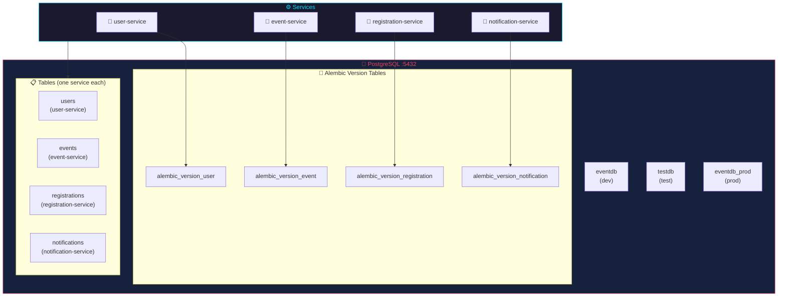
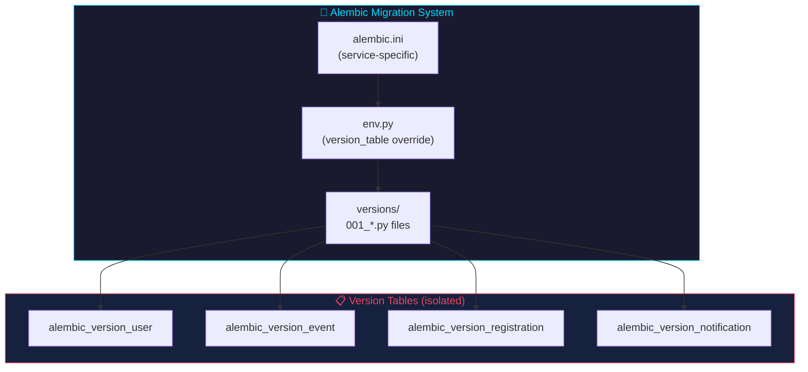
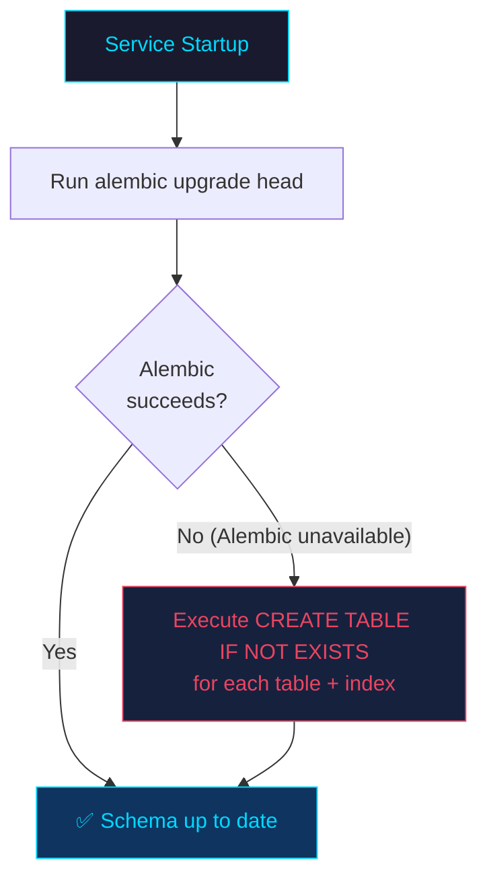
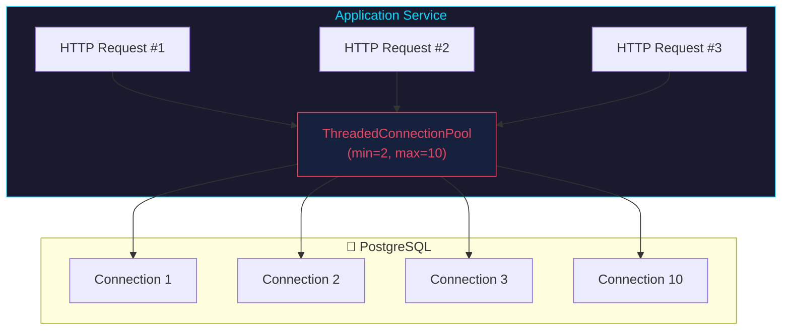
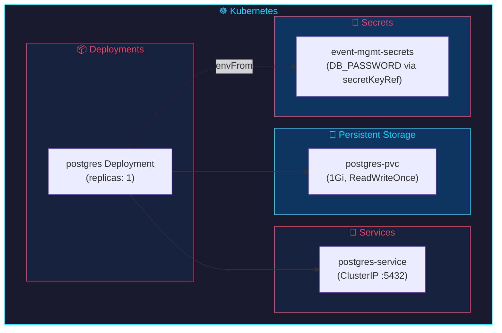

# Database (PostgreSQL)

## Overview

All services share a single PostgreSQL 16 instance but each owns its own tables. Connection pooling is managed per-service using `psycopg2.pool.ThreadedConnectionPool`.



---

## Connection Details

| Environment | Host | Port | Database | User | Password |
|-------------|------|------|----------|------|----------|
| Development | `postgres` | 5432 | `eventdb` | `postgres` | `postgres` |
| Testing | `postgres` | 5432 | `testdb` | `postgres` | `postgres` |
| Production | `postgres` | 5432 | `eventdb_prod` | `postgres` | `${DB_PASSWORD}` |

---

## Tables

### `users` (user-service)

| Column | Type | Constraints |
|--------|------|-------------|
| id | SERIAL | PRIMARY KEY |
| username | VARCHAR(50) | UNIQUE NOT NULL |
| email | VARCHAR(100) | UNIQUE NOT NULL |
| password_hash | VARCHAR(200) | NOT NULL |
| full_name | VARCHAR(100) | |
| created_at | TIMESTAMP | DEFAULT NOW() |
| is_active | BOOLEAN | DEFAULT TRUE |
| role | VARCHAR(20) | DEFAULT 'attendee' |

### `events` (event-service)

| Column | Type | Constraints |
|--------|------|-------------|
| id | SERIAL | PRIMARY KEY |
| title | VARCHAR(200) | NOT NULL |
| description | TEXT | |
| event_type | VARCHAR(50) | NOT NULL |
| start_date | TIMESTAMP | NOT NULL |
| end_date | TIMESTAMP | NOT NULL |
| location | VARCHAR(200) | |
| max_capacity | INT | NOT NULL DEFAULT 100 |
| registered_count | INT | DEFAULT 0 |
| organizer_id | INT | NOT NULL |
| ticket_price | DECIMAL(10,2) | DEFAULT 0.00 |
| status | VARCHAR(20) | DEFAULT 'active' |
| created_at | TIMESTAMP | DEFAULT NOW() |
| version | INT | NOT NULL DEFAULT 1 — Optimistic concurrency counter; incremented on PUT/DELETE |

### `registrations` (registration-service)

| Column | Type | Constraints |
|--------|------|-------------|
| id | SERIAL | PRIMARY KEY |
| user_id | INT | NOT NULL |
| event_id | INT | NOT NULL |
| registration_date | TIMESTAMP | DEFAULT NOW() |
| status | VARCHAR(20) | DEFAULT 'confirmed' |
| payment_method | VARCHAR(50) | DEFAULT 'free' |
| payment_status | VARCHAR(20) | DEFAULT 'pending' |
| payment_reference | VARCHAR(100) | |
| payment_gateway | VARCHAR(50) | |
| payment_processed_at | TIMESTAMP | |
| ticket_number | VARCHAR(20) | UNIQUE |
| notes | TEXT | |

**Unique constraint:** `(user_id, event_id)` — one registration per user per event.

### `notifications` (notification-service)

| Column | Type | Constraints |
|--------|------|-------------|
| id | SERIAL | PRIMARY KEY |
| user_id | INT | NOT NULL |
| title | VARCHAR(200) | NOT NULL |
| message | TEXT | |
| notification_type | VARCHAR(50) | DEFAULT 'info' |
| is_read | BOOLEAN | DEFAULT FALSE |
| created_at | TIMESTAMP | DEFAULT NOW() |

---

## Indexes

| Index | Table | Definition | Purpose |
|-------|-------|-----------|---------|
| `idx_users_email` | users | `(email) WHERE is_active=TRUE` | Login lookup, uniqueness check |
| `idx_events_status_type` | events | `(status, event_type)` | Filter active events by type |
| `idx_events_start_date` | events | `(start_date)` | Sort events by date |
| `idx_events_organizer` | events | `(organizer_id)` | Organizer ownership scoping |
| `idx_reg_user` | registrations | `(user_id)` | User's registration history |
| `idx_reg_event_status` | registrations | `(event_id, status)` | Event attendee list |
| `idx_notifications_user_read` | notifications | `(user_id, is_read)` | User notification feed |

All indexes are created via `CREATE INDEX IF NOT EXISTS` in each service's startup event, so they're auto-created on first run.

---

## Database Migrations (Alembic)

All 4 services use **Alembic** for version-controlled database schema migrations. Each service has its own Alembic configuration to prevent migration conflicts in the shared PostgreSQL database.



### Per-Service Configuration

| Service | alembic.ini | Version Table | Initial Migration |
|---------|-------------|---------------|-------------------|
| user-service | `services/user-service/alembic.ini` | `alembic_version_user` | `001_users` |
| event-service | `services/event-service/alembic.ini` | `alembic_version_event` | `001_events` (includes `version` column) |
| registration-service | `services/registration-service/alembic.ini` | `alembic_version_registration` | `001_registrations` |
| notification-service | `services/notification-service/alembic.ini` | `alembic_version_notification` | `001_notifications` |

### Isolated Version Tables

Each service uses a custom `version_table` in its `alembic/env.py` to avoid conflicting with other services' migration tracking:

```python
context.configure(
    connection=connection,
    target_metadata=target_metadata,
    version_table="alembic_version_<service>",
)
```

### Startup Behavior



Each service's `startup()` function attempts `alembic upgrade head` first, falling back to `CREATE TABLE IF NOT EXISTS` if Alembic is unavailable.

---

## Optimistic Concurrency (Events Table)

The `events` table includes a `version` column (`INT NOT NULL DEFAULT 1`) that enables optimistic concurrency control.

### Mechanism

```mermaid
sequenceDiagram
    participant C as Client A
    participant C2 as Client B
    participant PG as PostgreSQL

    Note over C,C2: Both clients read event v1
    C->>+PG: SELECT * FROM events WHERE id=1
    PG-->-C: {version: 1, title: "Old Title"}
    C2->>+PG: SELECT * FROM events WHERE id=1
    PG-->-C2: {version: 1, title: "Old Title"}

    Note over C: Client A updates first (wins)
    C->>+PG: UPDATE events SET title='New Title', version=version+1<br/>WHERE id=1 AND version=1
    PG-->-C: 1 row updated (now version=2)

    Note over C2: Client B updates with stale version (loses)
    C2->>+PG: UPDATE events SET title='Another Title', version=version+1<br/>WHERE id=1 AND version=1
    PG-->-C2: 0 rows updated (version is 2, not 1)
    C2-->-C2: 409 Conflict — fetch latest and retry
```

1. Every event row starts with `version = 1`
2. `PUT /events/{id}` requires `version` in the request body
3. `DELETE /events/{id}` requires `?version=N` query parameter
4. If the version matches, the update succeeds and `version` is incremented
5. If the version does not match, HTTP 409 is returned with conflict details

### Conflict Response (HTTP 409)

```json
{
  "message": "Optimistic concurrency conflict: event was modified by another request",
  "current_version": 3,
  "provided_version": 1
}
```

---

## Connection Pooling



Each service creates a `ThreadedConnectionPool` with the following configuration:

```python
psycopg2.pool.ThreadedConnectionPool(
    minconn=2,    # Minimum connections kept open
    maxconn=10,   # Maximum connections allowed
    host=os.getenv("DB_HOST", "postgres"),
    port=os.getenv("DB_PORT", "5432"),
    dbname=os.getenv("DB_NAME", "eventdb"),
    user=os.getenv("DB_USER", "postgres"),
    password=os.getenv("DB_PASSWORD", "postgres"),
)
```

**Why pooling?** Without pooling, each HTTP request creates a new TCP connection + PostgreSQL handshake. Pooling reuses connections, reducing latency from ~50ms to ~2ms per query.

---

## Connection Pool Tuning

All 4 services support configurable pool sizes and timeouts via environment variables:

| Variable | Default | Description |
|----------|---------|-------------|
| `DB_POOL_MIN` | `2` | Minimum connections kept open in the pool |
| `DB_POOL_MAX` | `10` | Maximum connections allowed in the pool |
| `DB_CONNECT_TIMEOUT` | `5` | Connection establishment timeout in seconds (`connect_timeout=5s`) |
| `DB_STATEMENT_TIMEOUT` | `5000` | Per-query timeout in milliseconds (`statement_timeout=5000ms`) |

**Usage in service code:**
```python
psycopg2.pool.ThreadedConnectionPool(
    minconn=int(os.getenv("DB_POOL_MIN", "2")),
    maxconn=int(os.getenv("DB_POOL_MAX", "10")),
    connect_timeout=int(os.getenv("DB_CONNECT_TIMEOUT", "5")),
    options=f"-c statement_timeout={os.getenv('DB_STATEMENT_TIMEOUT', '5000')}",
    ...
)
```

**Tuning guidelines:**
- Increase `DB_POOL_MAX` for services with higher concurrent traffic (e.g., event-service during popular event launches)
- Set `DB_POOL_MIN` to match baseline traffic to avoid connection churn
- The `statement_timeout` prevents runaway queries from consuming pool connections

---

## Pagination

List endpoints (`GET /events`, `GET /registrations`) use `LIMIT`/`OFFSET` pagination:

```sql
SELECT * FROM events
WHERE status = %s AND event_type = %s
ORDER BY start_date DESC
LIMIT %s OFFSET %s;
```

- `LIMIT` is derived from the `page_size` query parameter (default 20, max 100)
- `OFFSET` is calculated as `(page - 1) * page_size`
- Responses include `total`, `page`, `page_size`, and `total_pages` metadata

---

## Docker Compose Configuration

```yaml
postgres:
  image: postgres:16-alpine
  environment:
    POSTGRES_DB: eventdb
    POSTGRES_USER: postgres
    POSTGRES_PASSWORD: postgres
  volumes:
    - postgres_data:/var/lib/postgresql/data
  healthcheck:
    test: ["CMD-SHELL", "pg_isready -U postgres"]
    interval: 10s
    timeout: 5s
    retries: 5
```

**Volume:** `postgres_data` persists data across container restarts.

**Healthcheck:** Services wait for `postgres` to be healthy before starting (`condition: service_healthy`).

---

## Kubernetes



- **Deployment:** postgres container with resource limits
- **PVC:** `postgres-pvc` (1Gi storage)
- **Secret:** Credentials stored in Kubernetes Secret, referenced via `secretKeyRef`
- **Service:** `postgres-service` (ClusterIP) for internal access