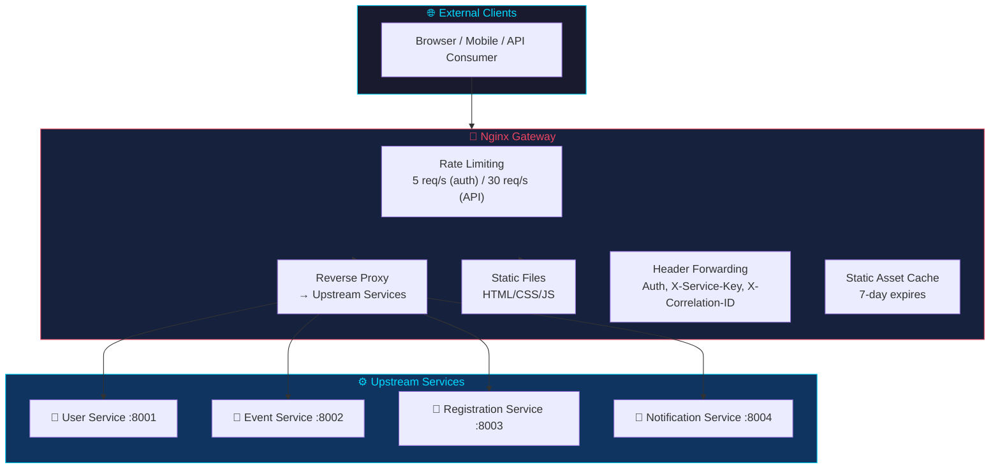
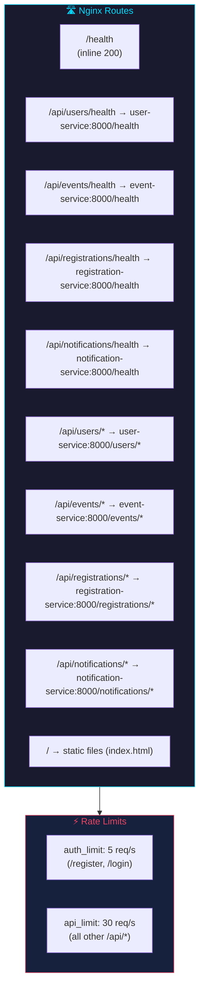
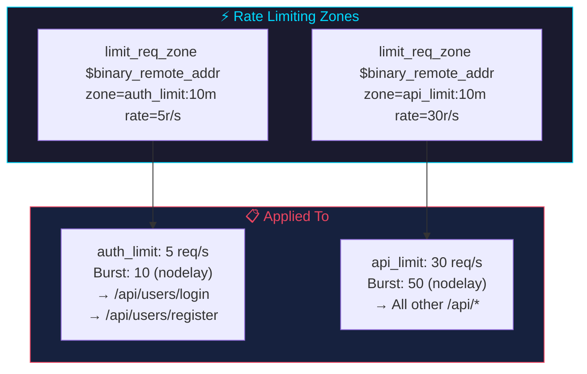
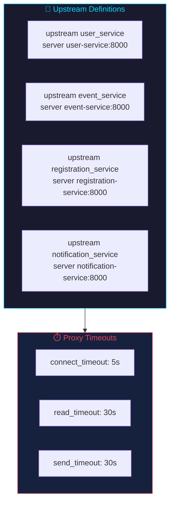
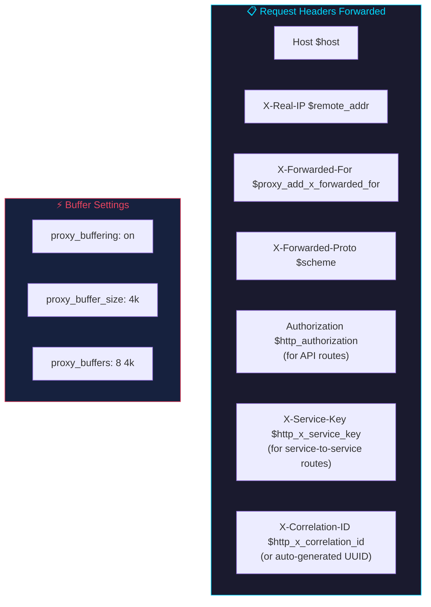
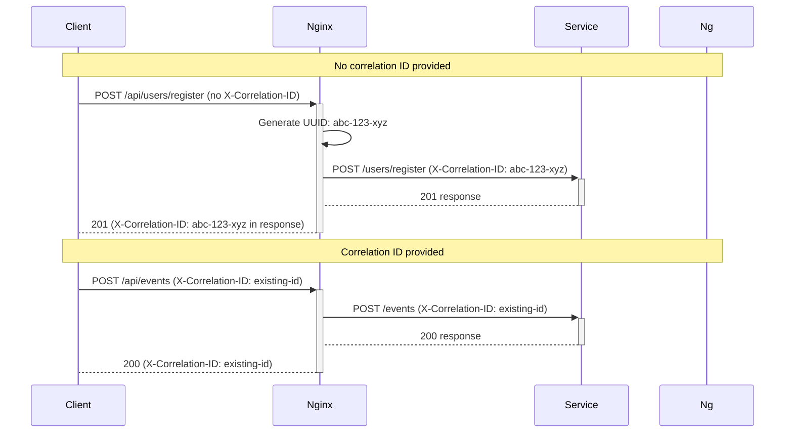

# Nginx (API Gateway)

## Overview

Nginx serves as the API gateway for the system.



Nginx handles:
1. **Reverse proxy** — Routes external requests to internal microservices
2. **Rate limiting** — Protects auth and API endpoints
3. **Static file serving** — Hosts the frontend HTML/CSS/JS
4. **Timeout management** — Prevents slow upstreams from blocking connections
5. **Health check proxy** — Routes per-service health checks through the gateway
6. **Auth header forwarding** — Passes Authorization and X-Service-Key headers to upstream services
7. **Correlation ID propagation** — Forwards `X-Correlation-ID` header to upstream services for distributed request tracing

| Property | Value |
|----------|-------|
| **Image** | Custom (`nginx` base) |
| **Port** | 80 (container), 8080 (dev), 8081 (test), 8082 (prod) |
| **Config** | `nginx/nginx.conf` |

---

## Route Mapping



| Gateway Path | Upstream Path | Service | Rate Limit |
|-------------|---------------|---------|-----------|
| `GET /health` | (inline response) | gateway | — |
| `GET /api/users/health` | `GET /health` | user-service | — |
| `GET /api/events/health` | `GET /health` | event-service | — |
| `GET /api/registrations/health` | `GET /health` | registration-service | — |
| `GET /api/notifications/health` | `GET /health` | notification-service | — |
| `POST /api/users/register` | `POST /users/register` | user-service | 5 req/s |
| `POST /api/users/login` | `POST /users/login` | user-service | 5 req/s |
| `* /api/users` | `* /users` | user-service | 30 req/s |
| `* /api/events` | `* /events` | event-service | 30 req/s |
| `* /api/registrations` | `* /registrations` | registration-service | 30 req/s |
| `* /api/notifications` | `* /notifications` | notification-service | 30 req/s |
| `GET /` | Static files | nginx | — |

**Priority:** More specific locations (`/api/users/login`, `/api/users/register`, `/api/*/health`) match before the generic `/api/users`.

---

## Rate Limiting Configuration



```nginx
limit_req_zone $binary_remote_addr zone=api_limit:10m rate=30r/s;
limit_req_zone $binary_remote_addr zone=auth_limit:10m rate=5r/s;
```

| Zone | Rate | Burst | Applied To |
|------|------|-------|------------|
| `auth_limit` | 5 req/s | 10 (nodelay) | `/api/users/login`, `/api/users/register` |
| `api_limit` | 30 req/s | 50 (nodelay) | All other `/api/*` endpoints |

- **10m zone size:** ~160,000 unique IP addresses tracked
- **nodelay:** Processes burst requests immediately, doesn't queue them

---

## Upstream Configuration



```nginx
upstream user_service {
    server user-service:8000;
}
upstream event_service {
    server event-service:8000;
}
upstream registration_service {
    server registration-service:8000;
}
upstream notification_service {
    server notification-service:8000;
}
```

Services are referenced by Docker Compose service name. All listen on port 8000 internally.

---

## Proxy Settings



| Setting | Value | Purpose |
|---------|-------|---------|
| `proxy_connect_timeout` | 5s | Upstream connection timeout |
| `proxy_read_timeout` | 30s | Waiting for upstream response |
| `proxy_send_timeout` | 30s | Sending request body to upstream |
| `proxy_buffering` | on | Buffer upstream responses |
| `proxy_buffer_size` | 4k | Response header buffer |
| `proxy_buffers` | 8 × 4k | Response body buffers |
| `client_body_timeout` | 12s | Client sending request body |
| `client_header_timeout` | 12s | Client sending headers |
| `send_timeout` | 10s | Sending response to client |
| `keepalive_timeout` | 65s | Keep-alive connection timeout |

---

## Correlation ID Flow



If no `X-Correlation-ID` header is present on the incoming request, a UUID is generated and attached by the gateway before proxying to upstream services.

---

## Static File Caching

```nginx
location ~* \.(js|css|png|jpg|jpeg|gif|ico|svg|woff2?)$ {
    expires 7d;
    add_header Cache-Control "public, immutable";
}
```

---

## Health Check Endpoints

```mermaid
flowchart TB
    subgraph Gateway["🚪 Gateway"]
        H1["GET /health → inline 200 {\"status\":\"gateway-healthy\"}"]
    end

    subgraph Proxied["🔗 Proxied to Services"]
        H2["GET /api/users/health → user-service:8000/health"]
        H3["GET /api/events/health → event-service:8000/health"]
        H4["GET /api/registrations/health → registration-service:8000/health"]
        H5["GET /api/notifications/health → notification-service:8000/health"]
    end

    H1
    H2 & H3 & H4 & H5

    style Gateway fill:#1a1a2e,stroke:#00d9ff,color:#00d9ff
    style Proxied fill:#16213e,stroke:#e94560,color:#e94560
```

### Gateway Health (inline)

```nginx
location /health {
    add_header Content-Type application/json;
    return 200 '{"status":"gateway-healthy"}';
}
```

### Per-Service Health (proxied)

```nginx
location /api/users/health {
    proxy_pass http://user_service/health;
}
location /api/events/health {
    proxy_pass http://event_service/health;
}
location /api/registrations/health {
    proxy_pass http://registration_service/health;
}
location /api/notifications/health {
    proxy_pass http://notification_service/health;
}
```

These allow CI pipelines and monitoring to check service health through the gateway without knowing internal service ports.

---

## Frontend Pages

| Route | File | Description |
|-------|------|-------------|
| `/` | `index.html` | Dashboard with stats, quick actions, recent events |
| `/users.html` | `users.html` | User registration and listing |
| `/events.html` | `events.html` | Event creation with capacity bars, type icons |
| `/registrations.html` | `registrations.html` | Tickets with event names, payment processing |
| `/notifications.html` | `notifications.html` | Notifications with type icons and unread indicators |

All routes use `try_files $uri $uri/ /index.html` for SPA-like fallback.

---

## Worker Configuration

```nginx
worker_processes auto;
events {
    worker_connections 1024;
}
```

- **auto** — Nginx detects CPU cores and spawns that many worker processes
- **1024 connections** per worker — sufficient for development and moderate production load