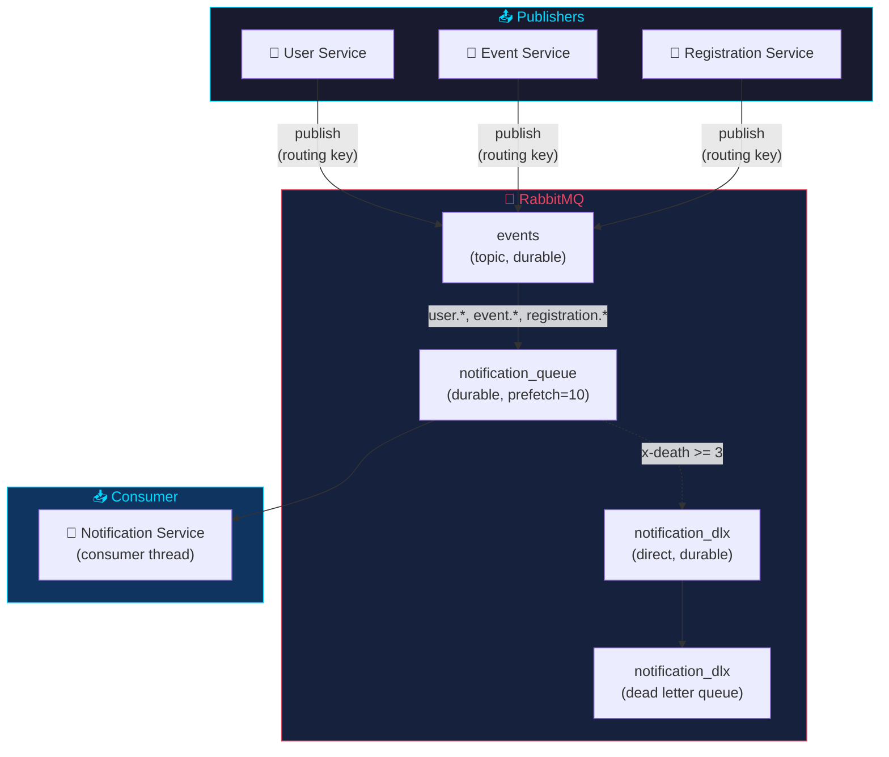
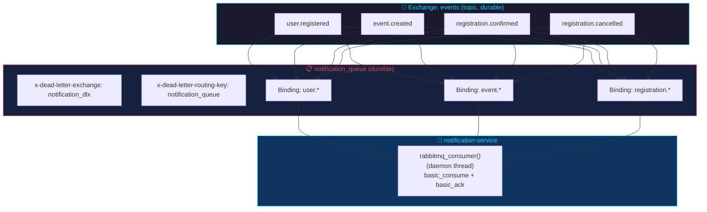
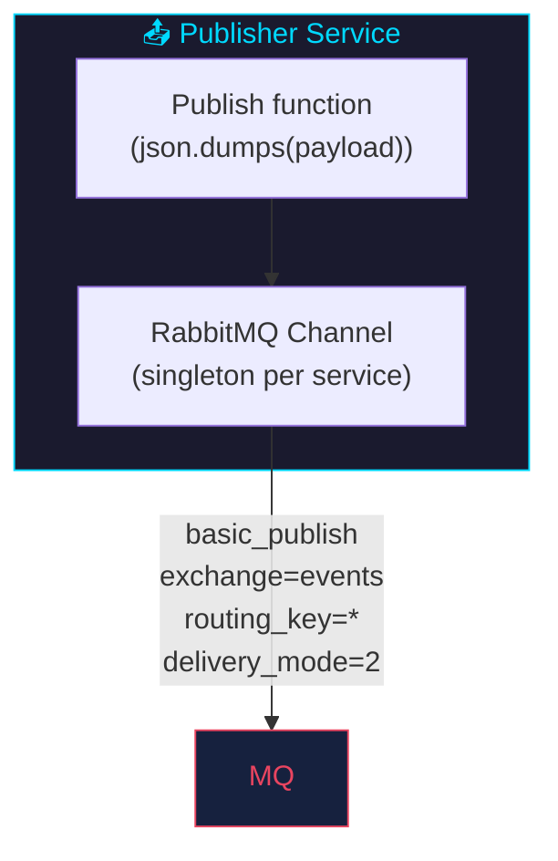
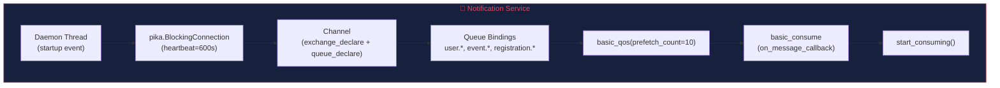
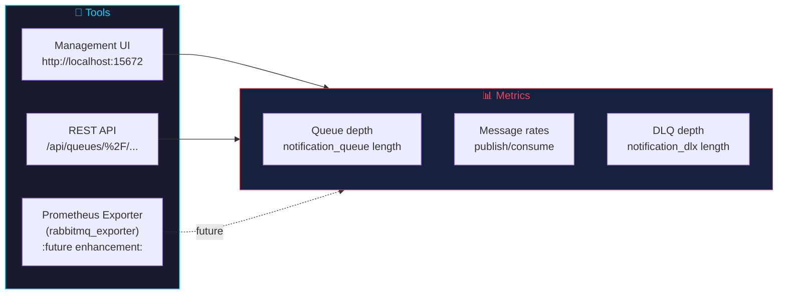

# RabbitMQ

## Overview

RabbitMQ is the async message broker for the event management system. Services publish events to a topic exchange, and the notification-service consumes them from a dedicated queue.



| Property | Value |
|----------|-------|
| **Image** | `rabbitmq:3-management-alpine` |
| **AMQP Port** | 5672 |
| **Management UI** | 15672 (guest/guest in dev) |
| **Exchange** | `events` (topic, durable) |
| **Consumer Queue** | `notification_queue` (durable) |

---

## Topology



---

## Exchange: `events`

- **Type:** `topic` — allows wildcard routing key matching
- **Durable:** Yes — survives RabbitMQ restarts
- **Declared by:** All services on startup

```python
channel.exchange_declare(
    exchange="events",
    exchange_type="topic",
    durable=True
)
```

---

## Queue: `notification_queue`

- **Durable:** Yes — messages survive RabbitMQ restarts
- **Consumer:** notification-service (single background thread)
- **Bindings:**

| Routing Key | Binding |
|-------------|---------|
| `user.registered` | `notification_queue` |
| `event.created` | `notification_queue` |
| `registration.confirmed` | `notification_queue` |
| `registration.cancelled` | `notification_queue` |

---

## Message Flow

```mermaid
sequenceDiagram
    participant P as Publisher
    participant EX as events exchange
    participant Q as notification_queue
    participant NS as Notification Service
    participant PG as PostgreSQL

    P->>+EX: basic_publish(routing_key, body)
    EX->>+Q: Route message to queue
    Q->>+NS: basic_deliver (on_message_callback)

    alt Processing succeeds
        NS->>+PG: INSERT notification
        PG-->-NS: notification created
        NS-->-Q: basic_ack
    else Processing fails
        NS-->-Q: basic_nack(requeue=True)
        Note over Q: Message requeued, will retry (up to 3x via x-death)

        loop After 3 failures
            Q->>+NS: basic_deliver
            NS->>NS: Try processing again
            alt Success
                NS->>PG: INSERT notification
                PG-->-NS: created
                NS-->-Q: basic_ack
            else Fail again
                NS-->-Q: basic_nack(requeue=False)
                Note over Q: x-death >= 3, route to DLX
            end
        end
    end
```

---

## Message Format

All messages are JSON with `content_type: application/json` and `delivery_mode: 2` (persistent).

### Example: `user.registered`

```json
{
  "event": "user_registered",
  "user_id": 1,
  "email": "alice@test.com",
  "full_name": "Alice Smith"
}
```

### Example: `registration.confirmed`

```json
{
  "event": "registration_confirmed",
  "user_id": 1,
  "event_id": 2,
  "ticket_number": "TKT-0005-MG98S2",
  "registration_id": 5
}
```

---

## Publisher Configuration



All publishing services (user, event, registration) use the same pattern:

```python
def publish_event(routing_key: str, payload: dict):
    ch = _get_rabbitmq_channel()
    ch.basic_publish(
        exchange="events",
        routing_key=routing_key,
        body=json.dumps(payload),
        properties=pika.BasicProperties(
            content_type="application/json",
            delivery_mode=2  # Persistent
        ),
    )
```

**Channel singleton:** Each service maintains a single RabbitMQ channel reused across requests.

**Error handling:** Publish failures are caught silently (`except Exception: pass`) to prevent blocking the main request flow.

---

## Consumer Configuration (notification-service)



The consumer runs in a daemon thread:

```python
def _consume_rabbitmq():
    connection = pika.BlockingConnection(params)
    channel = connection.channel()
    channel.exchange_declare(exchange="events", exchange_type="topic", durable=True)
    channel.queue_declare(queue="notification_queue", durable=True)
    for key in BINDING_KEYS:
        channel.queue_bind(queue="notification_queue", exchange="events", routing_key=key)
    channel.basic_consume(queue="notification_queue", on_message_callback=_on_message, auto_ack=False)
    channel.start_consuming()
```

**Manual ack:** Messages are acknowledged after successful DB insert. If the service crashes, unacked messages are requeued.

---

## Healthcheck

```yaml
healthcheck:
  test: ["CMD", "rabbitmq-diagnostics", "ping"]
  interval: 30s
  timeout: 10s
  retries: 5
```

**Why `ping` instead of `check_port_connectivity`?** The `check_port_connectivity` command caused 79% CPU usage. Switching to `ping` with a 30s interval reduced CPU to ~0.5%.

---

## Docker Compose

```yaml
rabbitmq:
  image: rabbitmq:3-management-alpine
  environment:
    RABBITMQ_DEFAULT_USER: guest
    RABBITMQ_DEFAULT_PASS: guest
  volumes:
    - rabbitmq_data:/var/lib/rabbitmq
  ports:
    - "5672:5672"      # AMQP
    - "15672:15672"    # Management UI
```

---

## Production Configuration

```yaml
rabbitmq:
  environment:
    RABBITMQ_DEFAULT_USER: ${RABBITMQ_USER:-eventapp}
    RABBITMQ_DEFAULT_PASS: ${RABBITMQ_PASSWORD:-changeme_in_prod}
```

Credentials are passed via environment variables, not hardcoded. Kubernetes uses `secretKeyRef` for the password.

---

## Monitoring



- **Management UI:** http://localhost:15672 (guest/guest in dev)
- **Queue status:** `GET /api/queues/%2F/notification_queue`
- **Exchange status:** `GET /api/exchanges/%2F/events`
- **Prometheus:** rabbitmq_exporter (future enhancement)