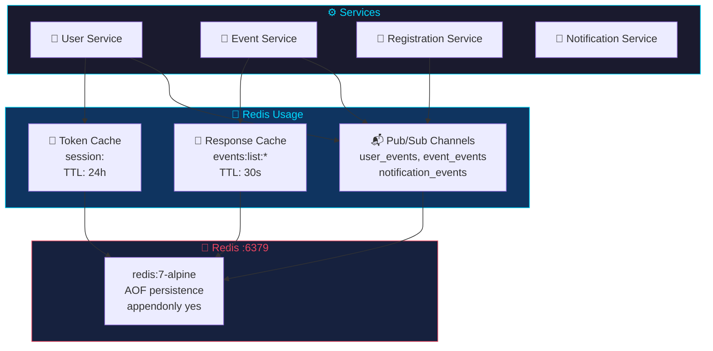
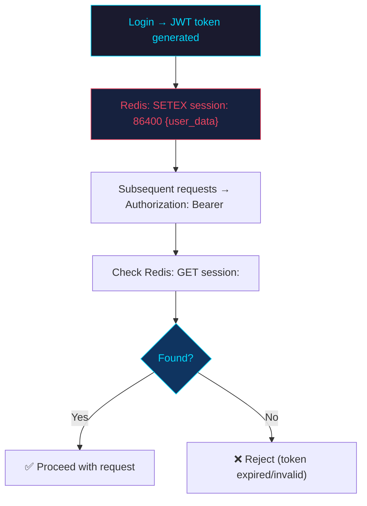
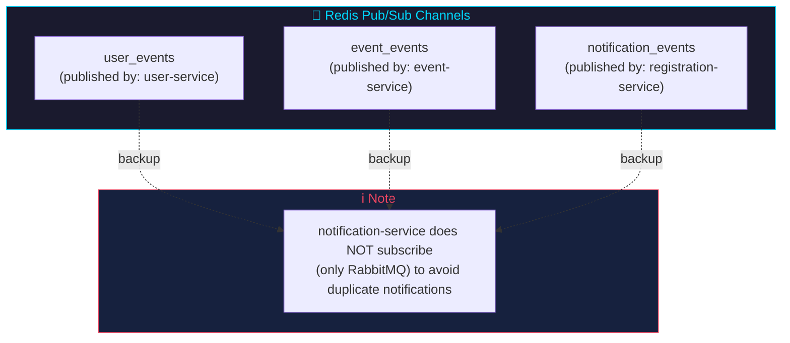
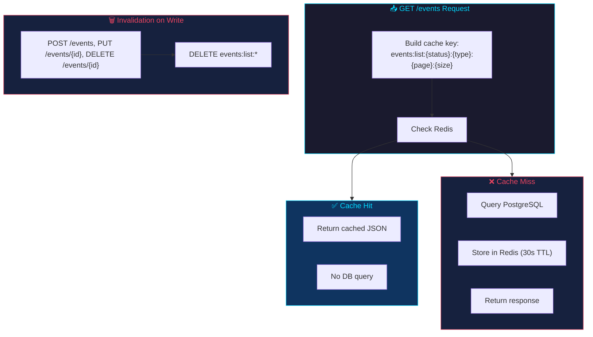
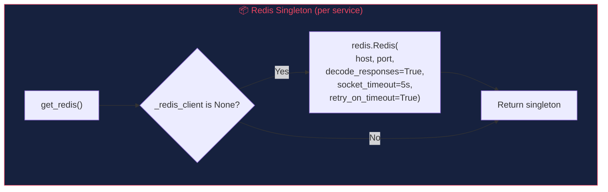
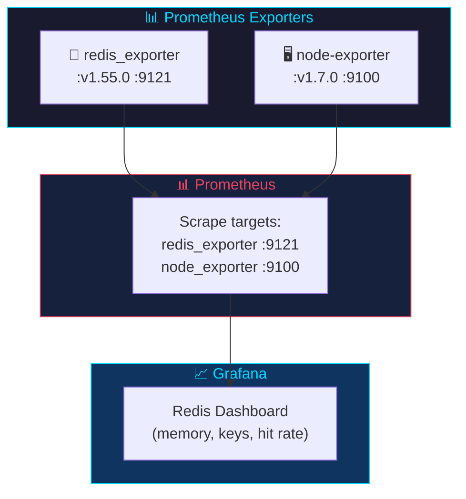
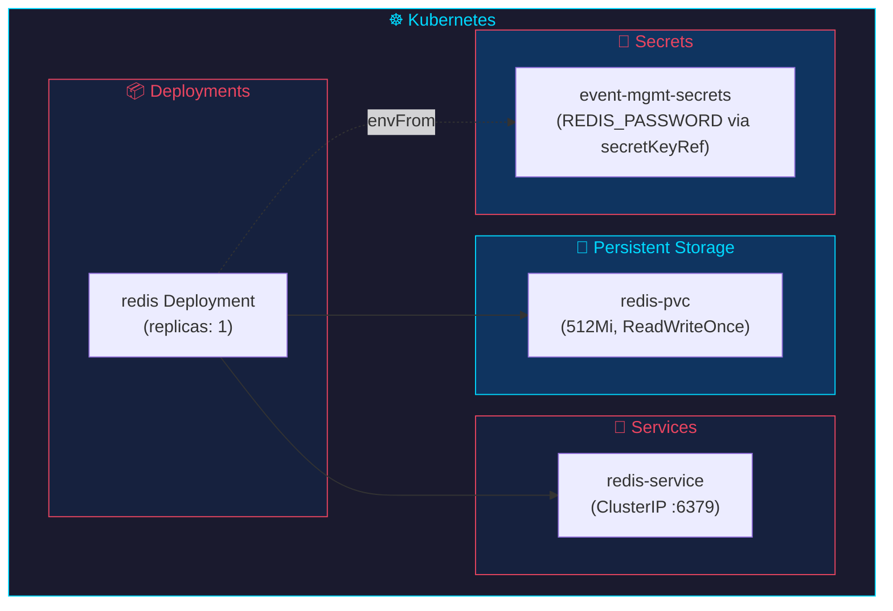

# Redis

## Overview

Redis serves as a secondary pub-sub channel, token cache, and response cache for the event management system.



| Property | Value |
|----------|-------|
| **Image** | `redis:7-alpine` |
| **Port** | 6379 |
| **Persistence** | AOF (appendonly yes) |
| **Volume** | `redis_data` |

---

## Usage Patterns

### Token Storage (user-service)



After login, the user-service stores the JWT token in Redis with a 24-hour TTL:

```python
r = get_redis()
r.setex(f"session:{token}", 86400, json.dumps(dict(user)))
```

Note: Key prefix changed from `token:` to `session:`, and the token is now a JWT (not random hex).

### Pub-Sub Publishing



| Service | Channel | Event |
|---------|---------|-------|
| user-service | `user_events` | `user_registered` |
| event-service | `event_events` | `event_created` |
| registration-service | `notification_events` | `registration_confirmed`, `registration_cancelled` |

**Note:** The notification-service does NOT subscribe to Redis channels — it only consumes from RabbitMQ to prevent duplicate notifications.

### Event Listing Cache



The event service caches `GET /events` responses in Redis to reduce database load on high-traffic list endpoints.

**Cache Key Format:**
```
events:list:{status}:{event_type}:{page}:{page_size}
```

**Examples:**
- `events:list:active:conference:1:20` — Active conferences, page 1
- `events:list:all::1:10` — All events (super_admin), page 1

**Configuration:**

| Setting | Value | Notes |
|---------|-------|-------|
| TTL | 30 seconds | Configurable via `CACHE_TTL` env var |
| Invalidation | On write | Cache keys are deleted on event create, update, or delete |
| Fallback | Direct DB query | If Redis is unavailable, the endpoint queries PostgreSQL directly |

**Behavior:**
1. On `GET /events`, the service builds the cache key from query parameters
2. If the key exists in Redis, the cached JSON is returned immediately
3. If the key is missing, the service queries PostgreSQL and stores the result with TTL
4. On `POST /events`, `PUT /events/{id}`, or `DELETE /events/{id}`, all `events:list:*` keys matching the pattern are invalidated

---

## Connection Configuration



Each service creates a Redis singleton:

```python
def get_redis():
    global _redis_client
    if _redis_client is None:
        _redis_client = redis.Redis(
            host=os.getenv("REDIS_HOST", "redis"),
            port=int(os.getenv("REDIS_PORT", "6379")),
            decode_responses=True,
            socket_connect_timeout=5,
            socket_timeout=5,
            retry_on_timeout=True,
        )
    return _redis_client
```

**Timeouts:** 5-second connect/read timeout prevents hanging on Redis failure.

**Error handling:** All Redis operations are wrapped in `try/except` — failures are silent and don't affect core functionality.

---

## Docker Compose

```yaml
redis:
  image: redis:7-alpine
  command: redis-server --appendonly yes
  volumes:
    - redis_data:/data
  healthcheck:
    test: ["CMD", "redis-cli", "ping"]
    interval: 10s
    timeout: 5s
    retries: 5
```

**AOF persistence:** `--appendonly yes` ensures data survives container restarts.

---

## Production Configuration

```yaml
redis:
  command: redis-server --appendonly yes --requirepass ${REDIS_PASSWORD:-changeme_in_prod}
```

Password authentication enabled in production. Services pass `REDIS_PASSWORD` via environment variables.

---

## Monitoring



- **Redis Exporter:** `oliver006/redis_exporter:v1.55.0` exposes metrics at `:9121`
- **Prometheus scrapes:** `http://redis-exporter:9121/metrics`
- **Grafana dashboard:** Redis metrics included in the overview dashboard

---

## Kubernetes



- **Deployment:** Redis container with resource limits
- **PVC:** `redis-pvc` (512Mi storage)
- **Secret:** Password stored in Kubernetes Secret