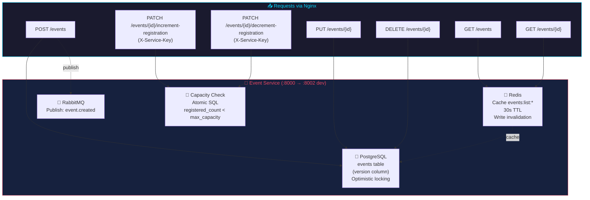
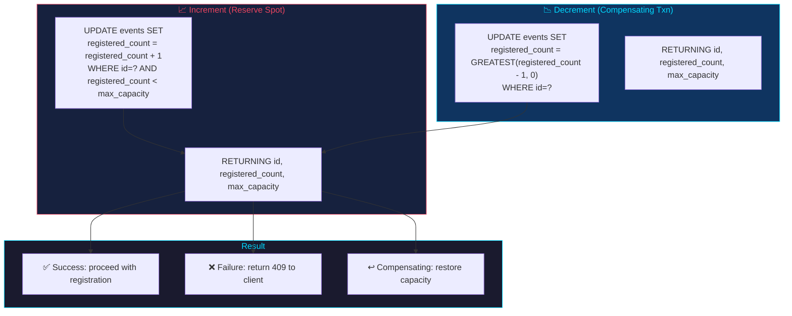
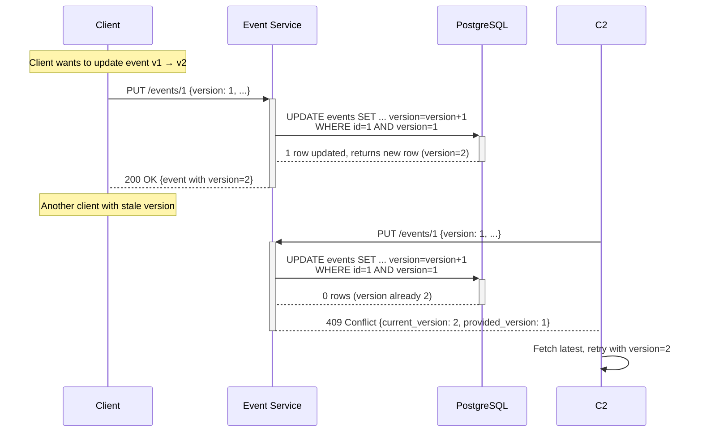
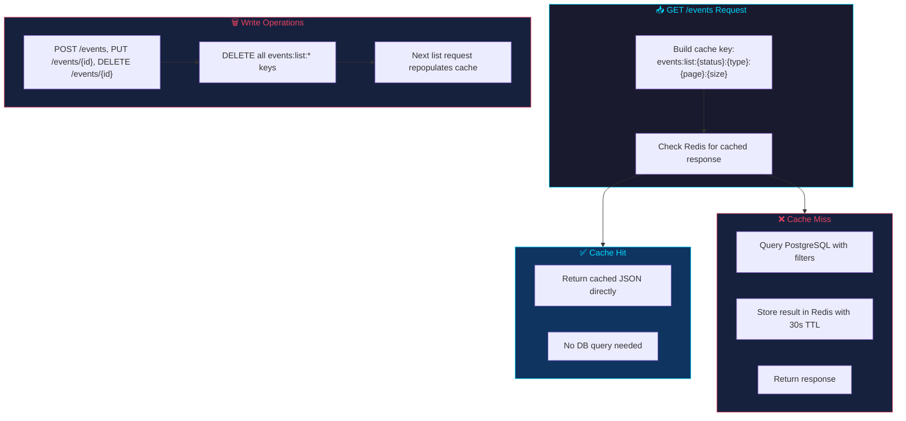

# Event Service

> Manages events: creation, retrieval, updates, cancellation, and capacity tracking with atomic increment/decrement operations.

---

## Overview



| Property | Value |
|----------|-------|
| **Port** | 8000 (internal), 8002 (dev exposed) |
| **Framework** | FastAPI |
| **Database Table** | `events` (includes `version` column for optimistic concurrency) |
| **RabbitMQ Publishing** | `event.created` |
| **Dockerfile** | Multi-stage `python:3.11-slim` |
| **Auth** | JWT + X-Service-Key for inter-service calls |
| **Concurrency** | Optimistic locking via `version` column (PUT/DELETE return 409 on conflict) |

---

## Architecture

### Event CRUD with Optimistic Locking

```mermaid
sequenceDiagram
    participant C as Client
    participant NG as Nginx
    participant ES as Event Service
    participant PG as PostgreSQL
    participant RD as Redis
    participant MQ as RabbitMQ

    Note over C,ES: Update Event (Optimistic Concurrency)
    C->>+NG: PUT /api/events/1 {title: "New Title", version: 3}
    NG->>+ES: PUT /events/1 {title: "New Title", version: 3}
    ES->>+PG: UPDATE events SET title=?, version=version+1<br/>WHERE id=1 AND version=3
    alt Version matches
        PG-->-ES: 1 row updated
        ES->>RD: DELETE events:list:*
        ES-->-NG: 200 {event}
        NG-->-C: 200 OK
    else Version mismatch
        PG-->-ES: 0 rows updated
        ES-->-NG: 409 Conflict {current_version: 5, provided_version: 3}
        NG-->-C: 409 Conflict
    end

    Note over ES,PG: Capacity Increment (Atomic)
    participant RS as Registration Service
    RS->>+ES: PATCH /events/1/increment-registration (X-Service-Key)
    ES->>+PG: UPDATE events SET registered_count=registered_count+1<br/>WHERE id=1 AND registered_count < max_capacity<br/>RETURNING id, registered_count, max_capacity
    alt Event has capacity
        PG-->-ES: {id: 1, registered_count: 101, max_capacity: 200}
        ES-->-RS: 200 {registered_count: 101}
    else Event full
        PG-->-ES: 0 rows updated
        ES-->-RS: 409 Event is full
    end
```

---

## Files

| File | Description |
|------|-------------|
| `main.py` | Application code: models, routes, DB schema, capacity management, RabbitMQ publisher |
| `Dockerfile` | Multi-stage build |
| `requirements.txt` | fastapi, uvicorn, psycopg2-binary, redis, pika, alembic, sqlalchemy, prometheus-fastapi-instrumentator |
| `alembic.ini` | Alembic configuration (version_table: `alembic_version_event`) |
| `alembic/env.py` | Migration environment with service-specific version table |
| `alembic/versions/001_create_events_table.py` | Initial migration: creates events table with version column and indexes |
| `.dockerignore` | Excludes build artifacts |

---

## Database Schema

```sql
CREATE TABLE IF NOT EXISTS events (
    id SERIAL PRIMARY KEY,
    title VARCHAR(200) NOT NULL,
    description TEXT,
    event_type VARCHAR(50) NOT NULL,
    start_date TIMESTAMP NOT NULL,
    end_date TIMESTAMP NOT NULL,
    location VARCHAR(200),
    max_capacity INT NOT NULL DEFAULT 100,
    registered_count INT DEFAULT 0,
    organizer_id INT NOT NULL,
    ticket_price DECIMAL(10,2) DEFAULT 0.00,
    status VARCHAR(20) DEFAULT 'active',
    version INT NOT NULL DEFAULT 1,
    created_at TIMESTAMP DEFAULT NOW()
);

CREATE INDEX IF NOT EXISTS idx_events_status_type ON events(status, event_type);
CREATE INDEX IF NOT EXISTS idx_events_start_date ON events(start_date);
CREATE INDEX IF NOT EXISTS idx_events_organizer ON events(organizer_id);
```

### Schema Diagram

```mermaid
erDiagram
    events {
        int id PK
        varchar title NN
        text description
        varchar event_type NN
        timestamp start_date NN
        timestamp end_date NN
        varchar location
        int max_capacity NN
        int registered_count
        int organizer_id NN FK
        decimal ticket_price
        varchar status
        int version NN
        timestamp created_at
    }
```

---

## Authentication & Authorization

| Endpoint Group | Required Role | Notes |
|---------------|---------------|-------|
| `POST /events` | organizer, super_admin | Super admins can specify organizer_id |
| `GET /events` | Any authenticated user or service (X-Service-Key) | Super admins can use status=all |
| `GET /events/{id}` | Any authenticated user or service (X-Service-Key) | — |
| `PUT /events/{id}` | organizer (own events only), super_admin | Ownership verified |
| `DELETE /events/{id}` | organizer (own events only), super_admin | Ownership verified |
| `PATCH /events/{id}/increment-registration` | Service key (X-Service-Key) or super_admin | Internal use by registration-service |
| `PATCH /events/{id}/decrement-registration` | Service key (X-Service-Key) or super_admin | Internal use by registration-service |

---

## Endpoints

### `POST /events`

Create a new event. `organizer_id` defaults to JWT `user_id` unless super_admin specifies it.

**Requires:** Bearer token (organizer or super_admin)

**Request Body:**
```json
{
  "title": "Tech Summit",
  "description": "Annual tech conference",
  "event_type": "conference",
  "start_date": "2026-07-01 09:00:00",
  "end_date": "2026-07-03 18:00:00",
  "location": "Convention Center",
  "max_capacity": 200,
  "organizer_id": 1,
  "ticket_price": 49.99
}
```

**Response (200):**
```json
{
  "message": "Event created",
  "event": {
    "id": 1,
    "title": "Tech Summit",
    "description": "Annual tech conference",
    "event_type": "conference",
    "start_date": "2026-07-01 09:00:00",
    "end_date": "2026-07-03 18:00:00",
    "location": "Convention Center",
    "max_capacity": 200,
    "registered_count": 0,
    "organizer_id": 1,
    "ticket_price": 49.99,
    "status": "active",
    "created_at": "2026-05-10 18:10:37.179179"
  }
}
```

**Errors:**
- `400` — `end_date` must be after `start_date`

**Side Effects:**
- Publishes `event.created` to RabbitMQ
- Publishes to Redis channel `event_events`

---

### `GET /events`

List events with optional filtering and pagination.

**Query Parameters:**
- `event_type` (optional) — Filter by event type
- `status` (optional, default: `active`) — Filter by status
- `page` (optional, default: `1`) — Page number (1-indexed)
- `page_size` (optional, default: `20`, max: `100`) — Items per page

**Response (200):**
```json
{
  "events": [...],
  "total": 42,
  "page": 1,
  "page_size": 20,
  "total_pages": 3
}
```

---

### `GET /events/{event_id}`

Get event by ID.

**Errors:**
- `404` — Event not found

---

### `PUT /events/{event_id}`

Update event fields. Organizers can only update their own events; super_admin can update any. Requires `version` in request body for optimistic concurrency control.

**Requires:** Bearer token (organizer — own events only, or super_admin)

**Request Body:**
```json
{
  "title": "Updated Title",
  "description": "Updated description",
  "max_capacity": 300,
  "version": 1
}
```

**Errors:**
- `409` — Version conflict (event was modified by another request; client should fetch latest and retry)

---

### `PATCH /events/{event_id}/increment-registration`

Atomically increment `registered_count`. Fails if event is full. Requires X-Service-Key or super_admin.

**Requires:** X-Service-Key header or Bearer token (super_admin)

**Response (200):**
```json
{"id": 1, "registered_count": 101, "max_capacity": 200}
```

**Errors:**
- `409` — Event full or not found

**Used by:** Registration service (called synchronously via httpx)

---

### `PATCH /events/{event_id}/decrement-registration`

Atomically decrement `registered_count` (floor at 0). Used as a compensating transaction when registration fails. Requires X-Service-Key or super_admin.

**Requires:** X-Service-Key header or Bearer token (super_admin)

**Response (200):**
```json
{"id": 1, "registered_count": 100, "max_capacity": 200}
```

---

### `DELETE /events/{event_id}`

Cancel event (sets `status='cancelled'`). Organizers can only cancel their own events; super_admin can cancel any. Requires `?version=N` query parameter for optimistic concurrency control.

**Requires:** Bearer token (organizer — own events only, or super_admin)

**Query Parameters:**
- `version` (required) — Current version of the event for optimistic locking

**Errors:**
- `409` — Version conflict (event was modified by another request)

---

### `GET /health`

```json
{"status": "healthy", "service": "event-service"}
```

---

## Capacity Management



The increment/decrement endpoints are atomic SQL operations that prevent race conditions where multiple users register simultaneously.

---

## Optimistic Concurrency Control



**Mechanism:**
- Every row starts with `version = 1`
- `PUT` and `DELETE` operations include the current `version` in the request
- The SQL `WHERE` clause includes `AND version = %s`; the update also sets `version = version + 1`
- If the `WHERE` clause matches zero rows, the service returns `409 Conflict`

---

## Redis Caching



**Cache Key Format:** `events:list:{status}:{event_type}:{page}:{page_size}`

**Examples:**
- `events:list:active:conference:1:20` — Active conferences, page 1
- `events:list:all::1:10` — All events (super_admin), page 1

**Behavior:**
- On `GET /events`, the service builds the cache key from query parameters
- If the key exists in Redis, the cached JSON is returned immediately
- If the key is missing, the service queries PostgreSQL and stores the result with TTL
- On `POST /events`, `PUT /events/{id}`, or `DELETE /events/{id}`, all `events:list:*` keys are invalidated
- If Redis is unavailable, the endpoint queries PostgreSQL directly (graceful degradation)

---

## Connection Pool Configuration

The event service uses configurable connection pool settings via environment variables:

| Variable | Default | Description |
|----------|---------|-------------|
| `DB_POOL_MIN` | `2` | Minimum connections kept open |
| `DB_POOL_MAX` | `10` | Maximum connections allowed |
| `DB_CONNECT_TIMEOUT` | `5` | Connection timeout in seconds |

All pool connections use `statement_timeout=5000ms` to prevent long-running queries from blocking the pool.

---

## Database Migrations

The event service uses **Alembic** for database schema migrations. On startup, the `startup()` function attempts to run `alembic upgrade head` first. If Alembic fails, it falls back to executing `CREATE TABLE IF NOT EXISTS` SQL directly.

### Migration Chain

| Version | File | Description |
|---------|------|-------------|
| `001_events` | `alembic/versions/001_create_events_table.py` | Creates `events` table with `version` column and indexes |

### Version Table

Alembic tracks applied migrations in `alembic_version_event` (not the default `alembic_version`) to avoid conflicts with other services sharing the same PostgreSQL database.

---

## Structured Logging

The event service emits JSON-structured logs with correlation IDs for request tracing across services. Every log entry includes:

- `correlation_id` — Unique identifier propagated via the `X-Correlation-ID` HTTP header. If not provided, a UUID is generated at the gateway.
- `timestamp`, `level`, `service`, `message` — Standard fields.
- `method`, `path`, `status_code`, `duration_ms` — Request-scoped fields where applicable.

Example log entry:

```json
{
  "timestamp": "2026-05-12T10:30:00.123Z",
  "level": "INFO",
  "service": "event-service",
  "correlation_id": "a1b2c3d4-e5f6-7890-abcd-ef1234567890",
  "message": "Event created",
  "event_id": 1,
  "organizer_id": 1
}
```

---

## Dependencies

```
fastapi
uvicorn[standard]
psycopg2-binary
redis
pika
PyJWT>=2.8.0
alembic>=1.13.0
sqlalchemy>=2.0.0
prometheus-fastapi-instrumentator
```