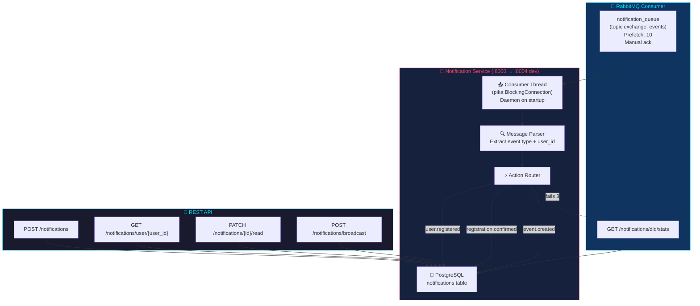
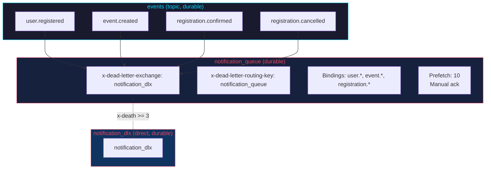
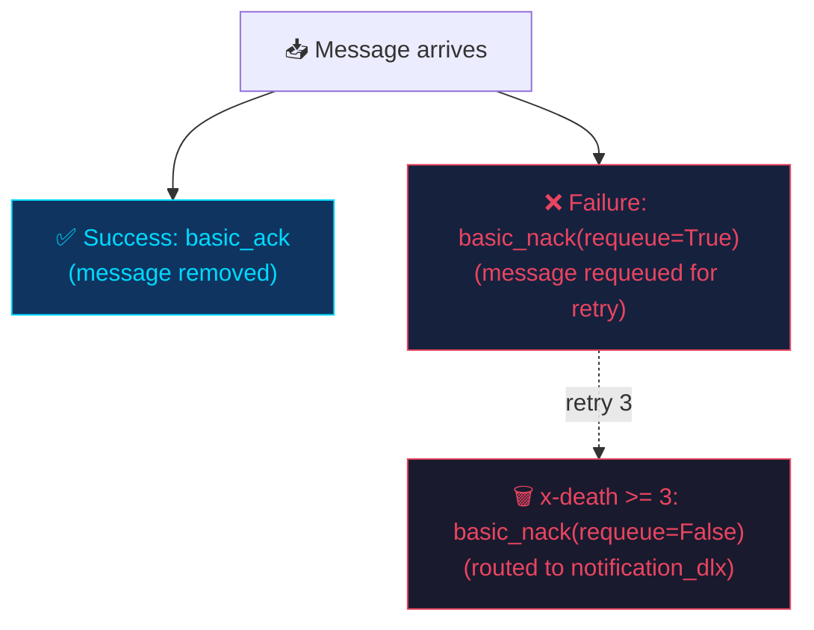

# Notification Service

> Consumes events from RabbitMQ and creates user notifications. Also provides REST endpoints for notification management and bulk broadcasting.

---

## Overview



| Property | Value |
|----------|-------|
| **Port** | 8000 (internal), 8004 (dev exposed) |
| **Framework** | FastAPI |
| **Database Table** | `notifications` |
| **RabbitMQ Consuming** | `notification_queue` bound to all routing keys on `events` exchange |
| **Dockerfile** | Multi-stage `python:3.11-slim` |
| **Auth** | JWT (scoped to own user; super_admin has full access) |

**Note:** This service does NOT include `redis` in its requirements. It only consumes from RabbitMQ to prevent duplicate notifications.

---

## Architecture

### Message Flow with Dead Letter Queue

```mermaid
sequenceDiagram
    participant MQ as RabbitMQ
    participant NS as Notification Service
    participant PG as PostgreSQL
    participant DLX as notification_dlx

    MQ->>+NS: Message on notification_queue
    NS->>NS: Parse JSON {event, user_id, ...}

    alt Processing succeeds
        NS->>+PG: INSERT INTO notifications
        PG-->-NS: notification created
        NS-->-MQ: basic_ack (remove message)
    else Processing fails (exception)
        NS-->-MQ: basic_nack (requeue=True)
        Note over MQ: Message requeued for retry

        loop Up to 3 retries
            MQ->>+NS: Message again
            NS->>NS: Parse JSON
            NS->>PG: INSERT INTO notifications
            alt Success
                PG-->-NS: created
                NS-->-MQ: basic_ack
            else Failure
                NS-->-MQ: basic_nack
            end
        end

        Note over NS: After 3 failures (x-death count >= 3)
        NS-->-MQ: basic_nack (requeue=False)
        MQ->>+DLX: Route to notification_dlx via DLX
        DLX-->-MQ: stored
    end
```

---

## Files

| File | Description |
|------|-------------|
| `main.py` | Application code: RabbitMQ consumer thread, notification CRUD, broadcast |
| `Dockerfile` | Multi-stage build |
| `requirements.txt` | fastapi, uvicorn, psycopg2-binary, pika, alembic, sqlalchemy, prometheus-fastapi-instrumentator |
| `alembic.ini` | Alembic configuration (version_table: `alembic_version_notification`) |
| `alembic/env.py` | Migration environment with service-specific version table |
| `alembic/versions/001_create_notifications_table.py` | Initial migration: creates notifications table and user/read index |
| `.dockerignore` | Excludes build artifacts |

**Note:** This service does NOT include `redis` in its requirements. It only consumes from RabbitMQ to prevent duplicate notifications.

---

## Database Schema

```sql
CREATE TABLE IF NOT EXISTS notifications (
    id SERIAL PRIMARY KEY,
    user_id INT NOT NULL,
    title VARCHAR(200) NOT NULL,
    message TEXT,
    notification_type VARCHAR(50) DEFAULT 'info',
    is_read BOOLEAN DEFAULT FALSE,
    created_at TIMESTAMP DEFAULT NOW()
);

CREATE INDEX IF NOT EXISTS idx_notifications_user_read ON notifications(user_id, is_read);
```

### Schema Diagram

```mermaid
erDiagram
    notifications {
        int id PK
        int user_id NN FK
        varchar title NN
        text message
        varchar notification_type
        bool is_read
        timestamp created_at
    }

    users ||--o{ notifications : "receives"
```

---

## Authentication & Authorization

| Endpoint Group | Required Role | Notes |
|---------------|---------------|-------|
| `POST /notifications` | super_admin | — |
| `GET /notifications/user/{user_id}` | Own user or super_admin | Scoped to requesting user |
| `PATCH /notifications/{id}/read` | Own user or super_admin | Ownership verified before marking read |
| `POST /notifications/broadcast` | super_admin | — |

---

## Endpoints

### `POST /notifications`

Create a single notification. super_admin only.

**Requires:** Bearer token (super_admin)

**Request Body:**
```json
{
  "user_id": 1,
  "title": "Welcome!",
  "message": "Welcome Alice! Your account has been created.",
  "notification_type": "info"
}
```

**Response (200):**
```json
{
  "message": "Notification sent",
  "notification": {
    "id": 1,
    "user_id": 1,
    "title": "Welcome!",
    "message": "Welcome Alice! Your account has been created.",
    "notification_type": "info",
    "is_read": false,
    "created_at": "2026-05-10 18:15:57.788032"
  }
}
```

---

### `GET /notifications/user/{user_id}`

List all notifications for a user. Users can only view their own notifications; super_admin can view any.

**Requires:** Bearer token (own user or super_admin)

**Query Parameters:**
- `unread_only` (optional, boolean, default: false) — Only return unread notifications

**Response (200):**
```json
{
  "notifications": [
    {
      "id": 1,
      "user_id": 1,
      "title": "Welcome!",
      "message": "Welcome Alice! Your account has been created.",
      "notification_type": "info",
      "is_read": false,
      "created_at": "2026-05-10 18:15:57.788032"
    }
  ],
  "total": 1
}
```

---

### `PATCH /notifications/{notification_id}/read`

Mark a notification as read. Ownership verified before marking read.

**Requires:** Bearer token (own user or super_admin)

**Response (200):**
```json
{"message": "Marked as read"}
```

**Errors:**
- `404` — Notification not found

---

### `POST /notifications/broadcast`

Send the same notification to multiple users using a single bulk INSERT query. super_admin only.

**Requires:** Bearer token (super_admin)

**Request Body:**
```json
{
  "user_ids": [1, 2, 3],
  "title": "System Update",
  "message": "Maintenance scheduled for tonight"
}
```

**Response (200):**
```json
{"message": "Broadcast sent to 3 users"}
```

**Performance:** Uses `psycopg2` `cur.mogrify()` for efficient batch INSERT instead of N individual queries.

---

### `GET /health`

```json
{"status": "healthy", "service": "notification-service"}
```

---

## RabbitMQ Consumer

The notification service runs a background daemon thread that consumes messages from `notification_queue`.

### Queue Configuration



```
Exchange: "events" (type: topic, durable)
Queue: "notification_queue" (durable)
  x-dead-letter-exchange: "notification_dlx"
  x-dead-letter-routing-key: "notification_queue"
Bindings:
  - user.registered
  - event.created
  - registration.confirmed
  - registration.cancelled
Prefetch: 10 messages
```

### Message Processing

| Routing Key | Event Type | Action | Notification Type |
|-------------|-----------|--------|-------------------|
| `user.registered` | `user_registered` | Creates "Welcome!" notification for the user | `info` |
| `event.created` | `event_created` | Logs event title to console (no DB notification) | — |
| `registration.confirmed` | `registration_confirmed` | Creates "Registration Confirmed" notification with ticket number | `confirmation` |
| `registration.cancelled` | `registration_cancelled` | Logs cancellation to console (no DB notification) | — |

### Message Acknowledgment



- **Success:** `basic_ack` after processing — message is removed from queue
- **Failure:** `basic_nack` with `requeue=True` — message goes back to queue for retry
- This ensures no notifications are lost if the service crashes mid-processing

### Consumer Thread

```python
def rabbitmq_consumer():
    params = pika.ConnectionParameters(
        heartbeat=600,
        blocked_connection_timeout=300,
    )
    conn = pika.BlockingConnection(params)
    ch = conn.channel()
    ch.exchange_declare(exchange="events", exchange_type="topic", durable=True)
    result = ch.queue_declare(queue="notification_queue", durable=True)
    for key in ["user.registered", "event.created", "registration.confirmed", "registration.cancelled"]:
        ch.queue_bind(exchange="events", queue=result.method.queue, routing_key=key)
    ch.basic_qos(prefetch_count=10)
    ch.basic_consume(queue=queue_name, on_message_callback=callback)
    ch.start_consuming()
```

The consumer runs in a daemon thread started during the FastAPI `startup` event.

---

## Dead Letter Queue

The `notification_queue` is configured with a dead-letter exchange to capture messages that fail processing after repeated retries. This prevents poison messages from blocking the consumer indefinitely.

### Configuration

| Variable | Default | Description |
|----------|---------|-------------|
| `DLQ_MAX_RETRIES` | `3` | Maximum delivery attempts before routing to the DLQ |

### DLQ Statistics Endpoint

`GET /notifications/dlq/stats` (super_admin only) returns dead-letter queue statistics:

```json
{
  "dlq_queue": "notification_dlx",
  "message_count": 2,
  "consumer_count": 0,
  "messages": [
    {
      "routing_key": "user.registered",
      "headers": {
        "x-death": [
          {
            "count": 3,
            "reason": "rejected",
            "queue": "notification_queue",
            "time": "2026-05-12T10:15:00Z"
          }
        ]
      },
      "body": {"event": "user_registered", "user_id": 42}
    }
  ]
}
```

---

## Database Migrations

The notification service uses **Alembic** for database schema migrations. On startup, the `startup()` function attempts to run `alembic upgrade head` first. If Alembic fails, it falls back to executing `CREATE TABLE IF NOT EXISTS` SQL directly.

### Migration Chain

| Version | File | Description |
|---------|------|-------------|
| `001_notifications` | `alembic/versions/001_create_notifications_table.py` | Creates `notifications` table and `idx_notifications_user_read` index |

### Version Table

Alembic tracks applied migrations in `alembic_version_notification` (not the default `alembic_version`) to avoid conflicts with other services sharing the same PostgreSQL database.

---

## Structured Logging

The notification service emits JSON-structured logs with correlation IDs for request tracing across services. Every log entry includes:

- `correlation_id` — Unique identifier propagated via the `X-Correlation-ID` HTTP header. If not provided, a UUID is generated at the gateway.
- `timestamp`, `level`, `service`, `message` — Standard fields.
- `method`, `path`, `status_code`, `duration_ms` — Request-scoped fields where applicable.

Example log entry:

```json
{
  "timestamp": "2026-05-12T10:30:00.123Z",
  "level": "INFO",
  "service": "notification-service",
  "correlation_id": "a1b2c3d4-e5f6-7890-abcd-ef1234567890",
  "message": "Notification created",
  "notification_id": 15,
  "user_id": 1,
  "notification_type": "info"
}
```

---

## Dependencies

```
fastapi
uvicorn[standard]
psycopg2-binary
pika
PyJWT>=2.8.0
alembic>=1.13.0
sqlalchemy>=2.0.0
prometheus-fastapi-instrumentator
```