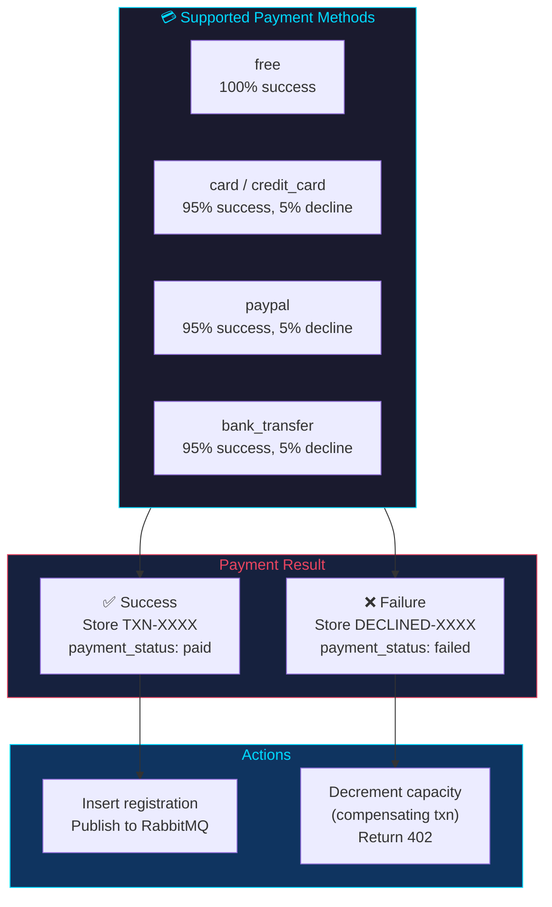
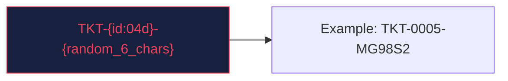
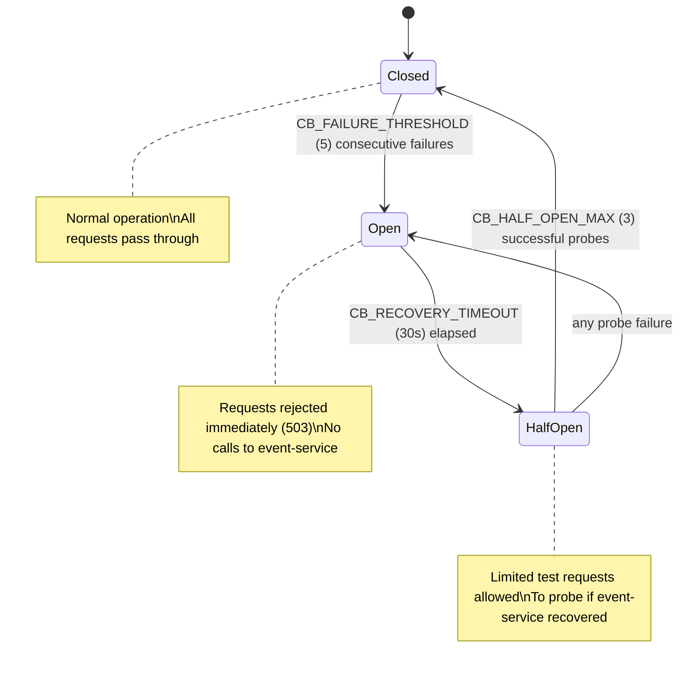

# Registration Service

> Handles event registrations with payment processing, capacity verification, and compensating transactions on failure.

---

## Overview

```mermaid
flowchart TB
    subgraph External["📥 Requests via Nginx"]
        R["POST /registrations"]
        L["GET /registrations"]
        G["GET /registrations/{id}"]
        GU["GET /registrations/user/{user_id}"]
        GE["GET /registrations/event/{event_id}"]
        PP["PATCH /registrations/{id}/payment"]
        PRP["POST /registrations/{id}/process-payment"]
        D["DELETE /registrations/{id}"]
    end

    subgraph Service["🎫 Registration Service (:8000 → :8003 dev)"]
        PG["🐘 PostgreSQL\nregistrations table\nUnique(user_id, event_id)"]
        HT["🔗 httpx HTTP Client\n→ Event Service\nCapacity check/increment"]
        CB["🔄 Circuit Breaker\nclosed → open → half-open\n3 states, configurable"]
        MQ["🐰 RabbitMQ\nPublish: registration.confirmed\nPublish: registration.cancelled"]
        PM["💳 Payment Mock\nfree: 100% | card/paypal: 95%\nTicket: TKT-XXXX-XXXX"]
    end

    R --> HT --> PM --> PG
    R --> CB
    CB -.error.->|"3+ failures"| HT
    PM -.success.-> MQ
    PG -.publish.-> MQ
    R --> PG
    D --> HT

    style Service fill:#16213e,stroke:#e94560,color:#e94560
    style External fill:#1a1a2e,stroke:#00d9ff,color:#00d9ff
```

| Property | Value |
|----------|-------|
| **Port** | 8000 (internal), 8003 (dev exposed) |
| **Framework** | FastAPI |
| **Database Table** | `registrations` |
| **RabbitMQ Publishing** | `registration.confirmed`, `registration.cancelled` |
| **Sync HTTP Calls** | Calls event-service for capacity management |
| **Dockerfile** | Multi-stage `python:3.11-slim` |
| **Auth** | JWT (user_id from token, not request body) |

---

## Architecture

### Registration Flow with Circuit Breaker & Compensating Transaction

```mermaid
sequenceDiagram
    participant C as Client
    participant NG as Nginx
    participant RS as Registration Service
    participant CB as Circuit Breaker
    participant ES as Event Service
    participant PG as PostgreSQL
    participant MQ as RabbitMQ
    participant NS as Notification Service

    C->>+NG: POST /api/registrations {event_id, payment_method}
    NG->>+RS: POST /registrations

    RS->>+CB: Check circuit state
    alt Circuit OPEN (3+ failures)
        CB-->-RS: 503 Service Unavailable
        RS-->-NG: 503 Circuit breaker open
        NG-->-C: 503
    else Circuit CLOSED or HALF-OPEN
        CB-->-RS: Proceed

        RS->>+ES: GET /events/{id} (X-Service-Key)
        ES-->-RS: event data
        RS->>+ES: PATCH /events/{id}/increment-registration (X-Service-Key)
        alt Event full
            ES-->-RS: 409 Conflict
            RS-->-NG: 409 Event is full
            NG-->-C: 409 Conflict
        end
        ES-->-RS: {registered_count: 101, max_capacity: 200}

        RS->>RS: process_payment_mock()
        alt Payment Success
            RS->>+PG: INSERT INTO registrations
            PG-->-RS: registration created
            RS->>RS: Generate ticket TKT-0001-AB1234
            RS->>MQ: Publish {event: registration_confirmed, ticket_number}
            RS-->-NG: 200 {registration, ticket}
            NG-->-C: 200 OK
            MQ->>+NS: registration.confirmed
        else Payment Failed
            RS->>+ES: PATCH /events/{id}/decrement-registration (X-Service-Key)
            ES-->-RS: capacity restored
            RS-->-NG: 402 Payment Failed
            NG-->-C: 402
        end
    end

    Note over CB: Circuit Breaker State Transitions
    RS->>+CB: failure++
    alt failure >= 5
        CB->>CB: State → OPEN
    end
```

---

## Files

| File | Description |
|------|-------------|
| `main.py` | Application code: payment processing, registration flow, capacity orchestration |
| `Dockerfile` | Multi-stage build |
| `requirements.txt` | fastapi, uvicorn, psycopg2-binary, redis, pika, httpx, alembic, sqlalchemy, prometheus-fastapi-instrumentator |
| `alembic.ini` | Alembic configuration (version_table: `alembic_version_registration`) |
| `alembic/env.py` | Migration environment with service-specific version table |
| `alembic/versions/001_create_registrations_table.py` | Initial migration: creates registrations table and indexes |
| `.dockerignore` | Excludes build artifacts |

---

## Database Schema

```sql
CREATE TABLE IF NOT EXISTS registrations (
    id SERIAL PRIMARY KEY,
    user_id INT NOT NULL,
    event_id INT NOT NULL,
    registration_date TIMESTAMP DEFAULT NOW(),
    status VARCHAR(20) DEFAULT 'confirmed',
    payment_method VARCHAR(50) DEFAULT 'free',
    payment_status VARCHAR(20) DEFAULT 'pending',
    payment_reference VARCHAR(100),
    payment_gateway VARCHAR(50),
    payment_processed_at TIMESTAMP,
    ticket_number VARCHAR(20) UNIQUE,
    notes TEXT,
    UNIQUE(user_id, event_id)
);

CREATE INDEX IF NOT EXISTS idx_reg_user ON registrations(user_id);
CREATE INDEX IF NOT EXISTS idx_reg_event_status ON registrations(event_id, status);
```

### Schema Diagram

```mermaid
erDiagram
    registrations {
        int id PK
        int user_id NN FK
        int event_id NN FK
        timestamp registration_date
        varchar status
        varchar payment_method
        varchar payment_status
        varchar payment_reference
        varchar payment_gateway
        timestamp payment_processed_at
        varchar ticket_number UK
        text notes
    }

    users ||--o{ registrations : "registers for"
    events ||--o{ registrations : "has"
```

---

## Authentication & Authorization

| Endpoint Group | Required Role | Notes |
|---------------|---------------|-------|
| `POST /registrations` | attendee, organizer, super_admin | user_id derived from JWT, not request body |
| `GET /registrations` | Any user (own only), super_admin (all) | Scoped to requesting user |
| `GET /registrations/{id}` | Own user or super_admin | — |
| `GET /registrations/user/{user_id}` | Own user or super_admin | — |
| `GET /registrations/event/{event_id}` | Any authenticated user | — |
| `PATCH /registrations/{id}/payment` | super_admin | — |
| `POST /registrations/{id}/process-payment` | Own user or super_admin | — |
| `DELETE /registrations/{id}` | Own user or super_admin | Sends X-Service-Key to event-service |

---

## Endpoints

### `POST /registrations`

Register a user for an event with payment processing. `user_id` is derived from the JWT token, not the request body.

**Request Body:**
```json
{
  "event_id": 2,
  "payment_method": "card",
  "notes": null
}
```

**Response (200):**
```json
{
  "message": "Registration successful",
  "registration": {
    "id": 5,
    "user_id": 1,
    "event_id": 2,
    "registration_date": "2026-05-10 19:01:53.269171",
    "status": "confirmed",
    "payment_method": "card",
    "payment_status": "paid",
    "ticket_number": "TKT-0005-MG98S2",
    "notes": null,
    "payment_reference": "TXN-D3835F77A60F011E",
    "payment_gateway": "simulated-card",
    "payment_processed_at": "2026-05-10 19:01:53.269171"
  }
}
```

**Errors:**
- `404` — Event not found
- `409` — Event is full / User already registered
- `402` — Payment failed
- `503` — Event service unavailable (circuit breaker open)

**Registration Flow:**
1. `GET /events/{id}` — Verify event exists (includes `X-Service-Key` header)
2. `PATCH /events/{id}/increment-registration` — Atomically reserve a spot (includes `X-Service-Key` header)
3. `process_payment_mock()` — Process payment
4. If payment fails → `PATCH /events/{id}/decrement-registration` (compensating transaction, includes `X-Service-Key` header)
5. If payment succeeds → `INSERT INTO registrations`
6. Generate ticket number (`TKT-{id:04d}-{random}`)
7. Publish `registration.confirmed` to RabbitMQ

---

### `GET /registrations`

List registrations with pagination (most recent first).

**Query Parameters:**
- `page` (optional, default: `1`) — Page number (1-indexed)
- `page_size` (optional, default: `20`, max: `100`) — Items per page

**Response (200):**
```json
{
  "registrations": [...],
  "total": 15,
  "page": 1,
  "page_size": 20,
  "total_pages": 1
}
```

---

### `GET /registrations/{id}`

Get registration by ID.

**Errors:**
- `404` — Registration not found

---

### `GET /registrations/user/{user_id}`

List all registrations for a specific user (newest first).

---

### `GET /registrations/event/{event_id}`

List confirmed registrations for a specific event.

---

### `PATCH /registrations/{id}/payment`

Update payment status.

**Request Body:**
```json
{"payment_status": "paid"}
```

---

### `POST /registrations/{id}/process-payment`

Retry payment processing for an existing registration.

**Request Body:**
```json
{
  "payment_method": "card",
  "amount": 49.99,
  "force_decline": false
}
```

---

### `DELETE /registrations/{id}`

Cancel a registration. Calls event-service to decrement capacity.

**Response (200):**
```json
{"message": "Registration cancelled"}
```

**Side Effects:**
- `PATCH /events/{id}/decrement-registration` on event-service (includes `X-Service-Key` header)
- Publishes `registration.cancelled` to RabbitMQ

---

### `GET /health`

```json
{"status": "healthy", "service": "registration-service", "circuit_breaker": {"state": "closed", "failure_count": 0, "last_failure": null}}
```

---

## Payment Processing



| Method | Success Rate | Reference Format | Gateway |
|--------|-------------|-----------------|---------|
| `free` | 100% | `FREE-XXXXXXXX` | `simulated-free` |
| `card` / `credit_card` | 95% | `TXN-XXXXXXXXXXXXXXXX` | `simulated-card` |
| `paypal` | 95% | `TXN-XXXXXXXXXXXXXXXX` | `simulated-paypal` |
| `bank_transfer` | 95% | `TXN-XXXXXXXXXXXXXXXX` | `simulated-bank_transfer` |

Declined payments return reference format `DECLINED-XXXXXXXX`.

---

## Ticket Number Format



---

## Circuit Breaker



### Configuration

| Variable | Default | Description |
|----------|---------|-------------|
| `CB_FAILURE_THRESHOLD` | `5` | Consecutive failures before opening the breaker |
| `CB_RECOVERY_TIMEOUT` | `30` | Seconds to wait before transitioning from open to half-open |
| `CB_HALF_OPEN_MAX` | `3` | Max test requests allowed in half-open state |

### Health Endpoint with Circuit Breaker State

```json
{
  "status": "healthy",
  "service": "registration-service",
  "circuit_breaker": {
    "state": "closed",
    "failure_count": 0,
    "last_failure": null
  }
}
```

---

## Database Migrations

The registration service uses **Alembic** for database schema migrations. On startup, the `startup()` function attempts to run `alembic upgrade head` first. If Alembic fails, it falls back to executing `CREATE TABLE IF NOT EXISTS` SQL directly.

### Migration Chain

| Version | File | Description |
|---------|------|-------------|
| `001_registrations` | `alembic/versions/001_create_registrations_table.py` | Creates `registrations` table and indexes |

### Version Table

Alembic tracks applied migrations in `alembic_version_registration` (not the default `alembic_version`) to avoid conflicts with other services sharing the same PostgreSQL database.

---

## Connection Pool Configuration

The registration service uses configurable connection pool settings via environment variables:

| Variable | Default | Description |
|----------|---------|-------------|
| `DB_POOL_MIN` | `2` | Minimum connections kept open |
| `DB_POOL_MAX` | `10` | Maximum connections allowed |
| `DB_CONNECT_TIMEOUT` | `5` | Connection timeout in seconds |

All pool connections use `statement_timeout=5000ms` to prevent long-running queries from blocking the pool.

---

## Structured Logging

The registration service emits JSON-structured logs with correlation IDs for request tracing across services. Every log entry includes:

- `correlation_id` — Unique identifier propagated via the `X-Correlation-ID` HTTP header. If not provided, a UUID is generated at the gateway.
- `timestamp`, `level`, `service`, `message` — Standard fields.
- `method`, `path`, `status_code`, `duration_ms` — Request-scoped fields where applicable.

Example log entry:

```json
{
  "timestamp": "2026-05-12T10:30:00.123Z",
  "level": "INFO",
  "service": "registration-service",
  "correlation_id": "a1b2c3d4-e5f6-7890-abcd-ef1234567890",
  "message": "Registration created",
  "registration_id": 5,
  "event_id": 2,
  "user_id": 1
}
```

---

## Dependencies

```
fastapi
uvicorn[standard]
psycopg2-binary
redis
pika
httpx
PyJWT>=2.8.0
alembic>=1.13.0
sqlalchemy>=2.0.0
prometheus-fastapi-instrumentator
```