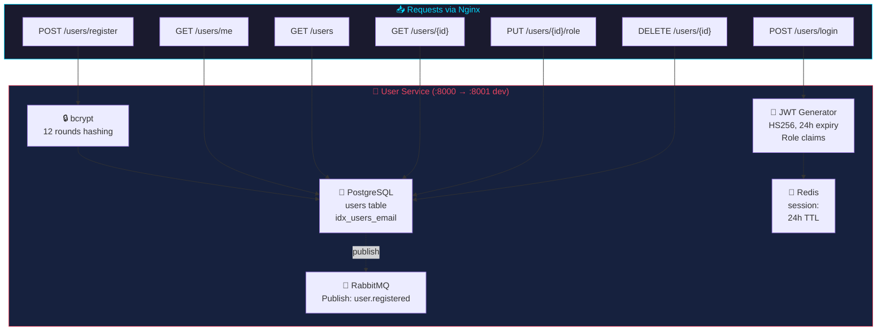
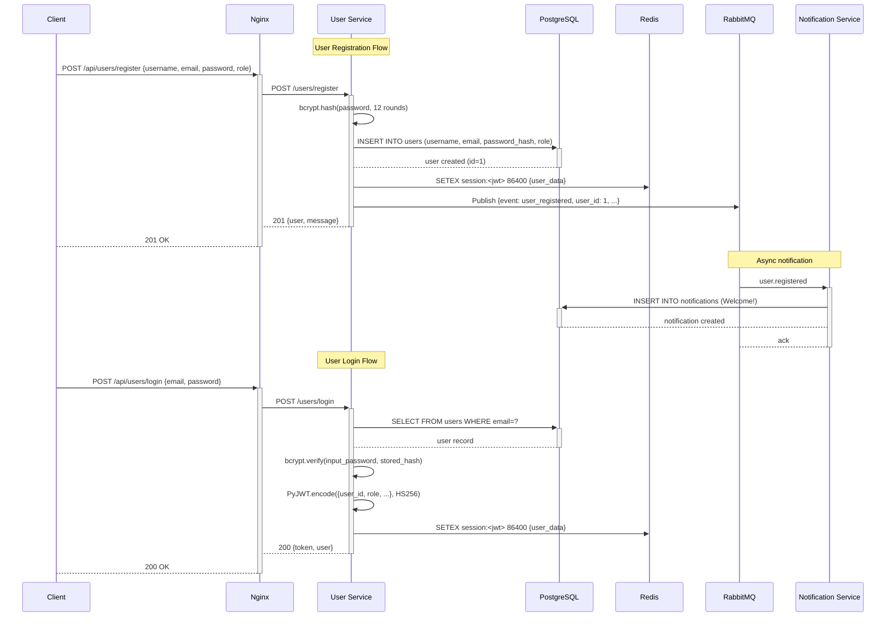
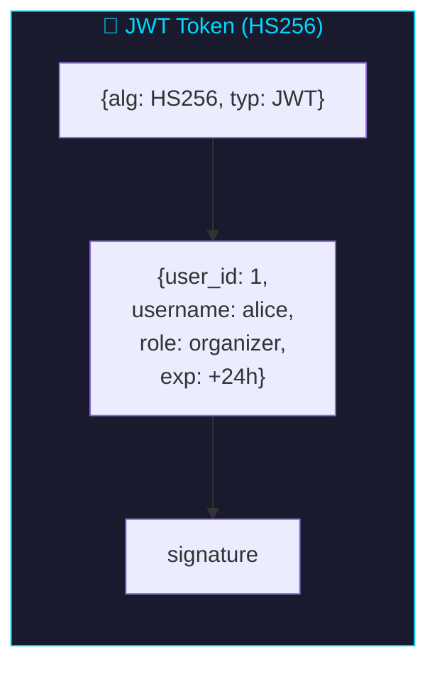

# User Service

> Manages user accounts: registration, authentication, profile retrieval, and soft-deletion.

---

## Overview



| Property | Value |
|----------|-------|
| **Port** | 8000 (internal), 8001 (dev exposed) |
| **Framework** | FastAPI |
| **Database Table** | `users` |
| **RabbitMQ Publishing** | `user.registered` |
| **Auth** | JWT (PyJWT, HS256, 24h expiry, RBAC with role claims) |
| **Dockerfile** | Multi-stage `python:3.11-slim` |

---

## Architecture

### Component Interaction



---

## Files

| File | Description |
|------|-------------|
| `main.py` | Application code: models, routes, DB schema, RabbitMQ publisher, Redis client |
| `Dockerfile` | Multi-stage build: builder + runtime with non-root user |
| `requirements.txt` | fastapi, uvicorn, psycopg2-binary, redis, pika, bcrypt, PyJWT, alembic, sqlalchemy, prometheus-fastapi-instrumentator |
| `alembic.ini` | Alembic configuration (version_table: `alembic_version_user`) |
| `alembic/env.py` | Migration environment with service-specific version table |
| `alembic/versions/001_create_users_table.py` | Initial migration: creates users table and email index |
| `.dockerignore` | Excludes `__pycache__`, `.venv`, `.git`, `__pycache__` |

---

## Database Schema

```sql
CREATE TABLE IF NOT EXISTS users (
    id SERIAL PRIMARY KEY,
    username VARCHAR(50) UNIQUE NOT NULL,
    email VARCHAR(100) UNIQUE NOT NULL,
    password_hash VARCHAR(200) NOT NULL,
    full_name VARCHAR(100),
    created_at TIMESTAMP DEFAULT NOW(),
    is_active BOOLEAN DEFAULT TRUE,
    role VARCHAR(20) DEFAULT 'attendee'
);

CREATE INDEX IF NOT EXISTS idx_users_email ON users(email) WHERE is_active=TRUE;
```

### Schema Diagram

```mermaid
erDiagram
    users {
        int id PK
        varchar username UK NN
        varchar email UK NN
        varchar password_hash NN
        varchar full_name
        timestamp created_at
        bool is_active
        varchar role
    }
```

---

## Endpoints

### `POST /users/register`

Register a new user.

**Input Validation:**
- `username`: 3-50 chars, alphanumeric + underscore
- `email`: valid email format (regex)
- `password`: 8-128 chars
- `full_name`: 1-100 chars
- `role`: one of `super_admin`, `organizer`, `attendee` (default: `attendee`)

**Request Body:**
```json
{
  "username": "alice",
  "email": "alice@test.com",
  "password": "Password123",
  "full_name": "Alice Smith",
  "role": "organizer"
}
```

**Response (201):**
```json
{
  "message": "User registered successfully",
  "user": {
    "id": 1,
    "username": "alice",
    "email": "alice@test.com",
    "full_name": "Alice Smith",
    "role": "organizer",
    "created_at": "2026-05-10 18:15:57.750469"
  }
}
```

**Errors:**
- `400` — Username or email already exists

**Side Effects:**
- Publishes `user.registered` to RabbitMQ → notification-service creates welcome notification
- Publishes to Redis channel `user_events`

---

### `POST /users/login`

Authenticate and receive a JWT token.

**Request Body:**
```json
{
  "email": "alice@test.com",
  "password": "Password123"
}
```

**Response (200):**
```json
{
  "token": "eyJhbGciOiJIUzI1NiIs...",
  "user": {
    "id": 1,
    "username": "alice",
    "email": "alice@test.com",
    "full_name": "Alice Smith"
  }
}
```

**Errors:**
- `401` — Invalid credentials

**Notes:**
- Returns a JWT token (HS256, 24h expiry) with `user_id` and `role` claims
- Token stored in Redis as `session:<jwt>` with 24h TTL
- Password verified using bcrypt

---

### `GET /users`

List all active users.

**Requires:** Bearer token (any authenticated user)

**Response (200):**
```json
{
  "users": [
    {"id": 1, "username": "alice", "email": "alice@test.com", "full_name": "Alice Smith", "created_at": "..."}
  ],
  "total": 1
}
```

---

### `GET /users/{user_id}`

Get a specific user by ID.

**Requires:** Bearer token (any authenticated user)

**Response (200):**
```json
{
  "id": 1,
  "username": "alice",
  "email": "alice@test.com",
  "full_name": "Alice Smith",
  "created_at": "2026-05-10 18:15:57.750469"
}
```

**Errors:**
- `404` — User not found or deactivated

---

### `DELETE /users/{user_id}`

Soft-delete a user (sets `is_active=FALSE`). Self-deletion allowed. super_admin can delete any user.

**Requires:** Bearer token (own user or super_admin)

**Response (200):**
```json
{"message": "User deactivated"}
```

**Errors:**
- `404` — User not found or already deactivated

---

### `GET /health`

```json
{"status": "healthy", "service": "user-service"}
```

---

### `GET /users/me`

Returns the current user's profile derived from the JWT token.

**Requires:** Bearer token (any authenticated user)

**Response (200):**
```json
{
  "id": 1,
  "username": "alice",
  "email": "alice@test.com",
  "full_name": "Alice Smith",
  "role": "attendee",
  "created_at": "2026-05-10 18:15:57.750469"
}
```

---

### `PUT /users/{user_id}/role`

Update a user's role. super_admin only.

**Requires:** Bearer token (super_admin)

**Request Body:**
```json
{
  "role": "organizer"
}
```

**Response (200):**
```json
{
  "message": "Role updated",
  "user": {
    "id": 1,
    "username": "alice",
    "role": "organizer"
  }
}
```

**Errors:**
- `403` — Not a super_admin
- `400` — Invalid role (must be super_admin/organizer/attendee)

---

## JWT Token Structure



Token is stored in Redis with key `session:<jwt>` and 24h TTL.

---

## Database Migrations

The user service uses **Alembic** for database schema migrations. On startup, the `startup()` function attempts to run `alembic upgrade head` first. If Alembic fails, it falls back to executing `CREATE TABLE IF NOT EXISTS` SQL directly.

### Migration Chain

| Version | File | Description |
|---------|------|-------------|
| `001_users` | `alembic/versions/001_create_users_table.py` | Creates `users` table and `idx_users_email` index |

### Version Table

Alembic tracks applied migrations in `alembic_version_user` (not the default `alembic_version`) to avoid conflicts with other services sharing the same PostgreSQL database.

---

## Structured Logging

The user service emits JSON-structured logs with correlation IDs for request tracing across services. Every log entry includes:

- `correlation_id` — Unique identifier propagated via the `X-Correlation-ID` HTTP header. If not provided, a UUID is generated at the gateway.
- `timestamp`, `level`, `service`, `message` — Standard fields.
- `method`, `path`, `status_code`, `duration_ms` — Request-scoped fields where applicable.

Example log entry:

```json
{
  "timestamp": "2026-05-12T10:30:00.123Z",
  "level": "INFO",
  "service": "user-service",
  "correlation_id": "a1b2c3d4-e5f6-7890-abcd-ef1234567890",
  "message": "User registered",
  "user_id": 1,
  "username": "alice"
}
```

---

## Dependencies

```
fastapi
uvicorn[standard]
psycopg2-binary
redis
pika
bcrypt
PyJWT>=2.8.0
alembic>=1.13.0
sqlalchemy>=2.0.0
prometheus-fastapi-instrumentator
```